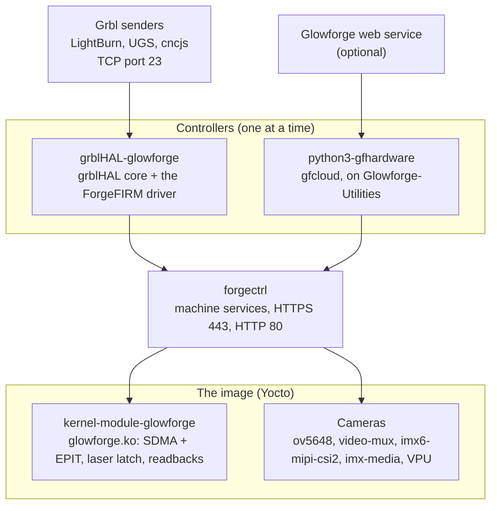

# Developers

This section tells you how to build, test, release, and change ForgeFIRM.
If you only want to operate the machine, read the Installation and Usage
sections instead.

| Page | Contents |
|---|---|
| [Build](building.md) | The build host, the Yocto build, the two images, and the build of each component. |
| [Release flow](release-flow.md) | The pins, the push order, the acceptance gate, and the signature. |
| [Acceptance](acceptance.md) | The release acceptance contract: the catalog, fingerprints and inheritance, campaigns, the gate. |
| [Test](testing.md) | The host tests in each repository, the CI workflows, and the coverage rule. |
| [The bench](bench.md) | The bench machine, the bench tools, the bench actuator, and the clean-up rule. |
| [Contribute](contributing.md) | The rules for code, proof, and documentation. |
| [This site](docs.md) | How this site is built, and where each subject goes. |

## The repositories

ForgeFIRM is a set of repositories under the
[OpenGlow organization](https://github.com/openglow-org) on GitHub. Each
component has its own repository. The `forgefirm` repository is the base
of the build. Each recipe gets its component from GitHub at a pinned
revision. Thus a build needs only two checkouts. For development, every
repository is checked out into one base working directory,
`openglow-forgefirm`, as siblings ([Build](building.md)).

| Repository | Contents | License |
|---|---|---|
| [`forgefirm`](https://github.com/openglow-org/forgefirm) | The base of the build and of the release: the `meta-forgefirm` Yocto layer, the kas configuration, the image recipes, the install and release scripts, the acceptance tool (`forgetest/`), the bench actuator firmware (`fixture/`), the bench tools (`scripts/bench/`), and the release artifacts (`releases/`). Two documents stay in this repository: `docs/BRINGUP.md`, the status document and cold-start runbook until the first production release, and `docs/CAMPAIGN-LOG.md`, the dated bench record. | MIT for the layer metadata. Each component has its own license. |
| [`meta-openglow`](https://github.com/openglow-org/meta-openglow) | The BSP layers, on the `scarthgap` branch. `meta-glowforge-bsp` defines the machine `glowforge`: the kernel, the device tree, U-Boot, and the board recipes. `meta-openglow-core` has the distro-neutral recipes that the images share. The ForgeFIRM build uses it as a sibling checkout. | MIT for the layer metadata |
| [`forgectrl`](https://github.com/openglow-org/forgectrl) | The machine-services daemon, in C, on HTTPS port 443 and HTTP port 80. It supervises the controller, brokers the pulse device, and gates motion liveness. It operates the cooling engine, the cameras, telemetry, settings, diagnostics, logging, the web control panel, and the A/B update system. [forgectrl](../technical/forgefirm/forgectrl.md) is the machine-services contract. | MIT |
| [`grblHAL-glowforge`](https://github.com/openglow-org/grblHAL-glowforge) | The grblHAL driver for the stock control board: the controller for GRBL mode. The grblHAL core is a git submodule at `src/grbl` ([openglow-org/grblHAL-core](https://github.com/openglow-org/grblHAL-core), branch `forgefirm`). The machine constants are in `src/boards/glowforge.h`. | GPL-3.0-or-later |
| [`kernel-module-glowforge`](https://github.com/openglow-org/kernel-module-glowforge) | `glowforge.ko`: the SDMA + EPIT pulse engine, the laser latch, the safety readbacks, and the sensors. [Pulse feeder contract](../technical/forgefirm/pulse-feeder-contract.md) is the pulse-stream feeder contract. | GPL-2.0-or-later |
| [`python3-gfhardware`](https://github.com/openglow-org/python3-gfhardware) | The `gfhardware` Python library for the machine hardware, and the cloud-mode applications in `forgefirm-app/`: `gfcloud.py` (the cloud-mode controller daemon), `gfhome.py` (one-shot homing through the Glowforge service), and `ffmachine.py` (the hardware glue that both use). [Cloud mode](../technical/forgefirm/cloud-mode.md) describes cloud mode. | MIT, with one LGPL-2.1-or-later component (see Licenses) |
| [`Glowforge-Utilities`](https://github.com/openglow-org/Glowforge-Utilities) | `gfutilities`, on PyPI: the factory protocol and service layer that cloud mode uses. It includes a machine emulator that speaks the real-time protocol without hardware. | MIT |
| [`forgefirm-docs`](https://github.com/openglow-org/forgefirm-docs) | This site. | CC BY-SA 4.0 |

## How the components connect

The controller parses G-code or dispatches the factory actions, turns motion
into pulse bytes, and feeds the kernel ring through forgectrl's broker.
forgectrl supervises the selected controller, holds the pulse device, runs
the cooling engine, the cameras, telemetry, settings, diagnostics, the web
control panel, and the A/B updates. The kernel module plays the pulse stream
into the stepper drivers and owns the laser latch and the safety readbacks.
The full description is under [Technical](../technical/forgefirm/index.md).

At build time, kas assembles the upstream layers (poky, meta-openembedded,
meta-freescale, meta-freescale-distro), the BSP layers from `meta-openglow`,
and `meta-forgefirm`. The component recipes get the source repositories at
their pinned revisions ([Release flow](release-flow.md)). One bitbake run
makes both images: `forgefirm-image`, the release image, and
`forgefirm-image-dev`, the bench image.

## Licenses

The code is free software under MIT and GPL licenses. The text of this site
is CC BY-SA 4.0.

Every image carries its own license accounting: the build writes the
image's license manifest (every installed package with its license) and
copies each package's license texts onto the rootfs, then packs both into
`/usr/share/forgefirm/licenses.tar.gz` and removes the loose tree, so the
texts the licenses ask to travel with the software travel with it at the
cost of one compressed file. The control panel shows the manifest at
`GET /licenses`, the "Licenses" link at the foot of every panel page,
serves the bundle at `GET /system/licenses`, and the manifest alone at
`GET /system/licenses/manifest`. Keep that step in every image you
redistribute.

These are the details that go past a one-word license:

- **grblHAL-glowforge** is GPL-3.0-or-later. It is derived from the
  [grblHAL Simulator](https://github.com/grblHAL/Simulator): the platform
  layer, and the shape of the stream and NVS code. The grblHAL core is
  copyright Terje Io and contributors. The Simulator platform code is
  copyright Jens Geisler and Adam Shelly. The Glowforge driver is copyright
  Scott Wiederhold.
- **kernel-module-glowforge** is GPL-2.0-or-later, copyright 2020-2026 Scott
  Wiederhold and copyright 2015-2021 Glowforge, Inc. The SDMA script
  assembler (`tools/sdma_asm.pl` and `tools/mx51_sdma_set.pm`) makes
  `src/sdma.asm.h` from `asm/sdma.asm` at build time. It is by Eli Billauer,
  copyright 2011, GPL-2.0-or-later, and its headers stay unchanged. Each
  file under `src/` has an `SPDX-License-Identifier` line.
- **python3-gfhardware** is MIT, with one component under a different
  license. `gfhardware/src/bayer.c` and `bayer.h` are the Bayer demosaic
  routines from libdc1394 (Damien Douxchamps, Frederic Devernay; VNG and AHD
  from the DCRAW of Dave Coffin). They are LGPL-2.1-or-later
  (`LICENSE.LGPL-2.1`). The build compiles them into the `gfhardware._cam`
  extension module together with the MIT sources. The repository has the
  full source of both parts and the standard build (`setup.py`). Thus anyone
  can change the LGPL component and build or link `_cam` again. This
  satisfies the relink condition of the LGPL. Binary packages from this
  repository, the ForgeFIRM image recipes included, declare
  `MIT & LGPL-2.1-or-later`.
- **The image** installs NXP firmware blobs (VPU, EPDC) from the i.MX6 BSP.
  NXP distributes them under its firmware EULA. The build configuration
  accepts it (`ACCEPT_FSL_EULA = "1"`). The image ships the license text
  next to the blobs, at `/usr/share/licenses/firmware-imx/EULA`. Keep it
  there in each image that you redistribute. The SDMA firmware comes from
  `linux-firmware`, which has its own license package.
