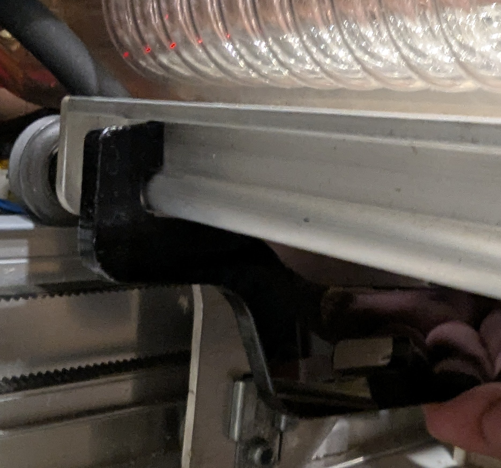
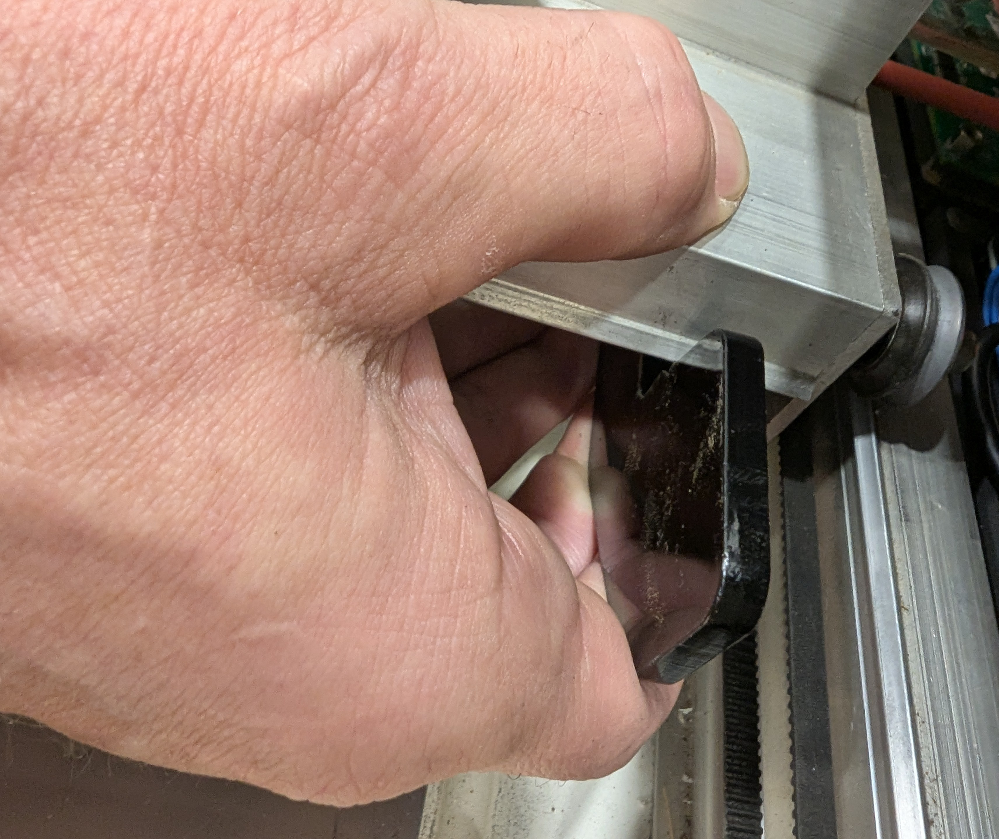
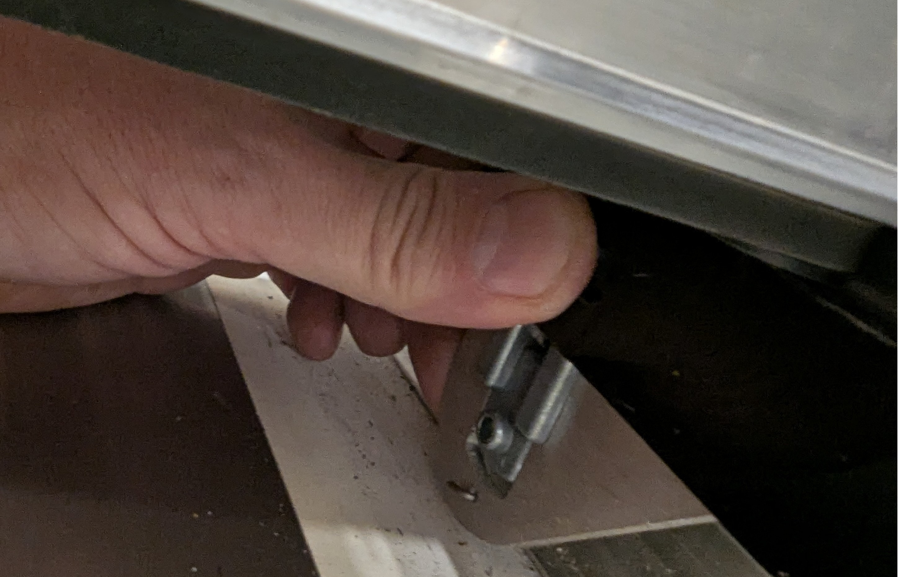
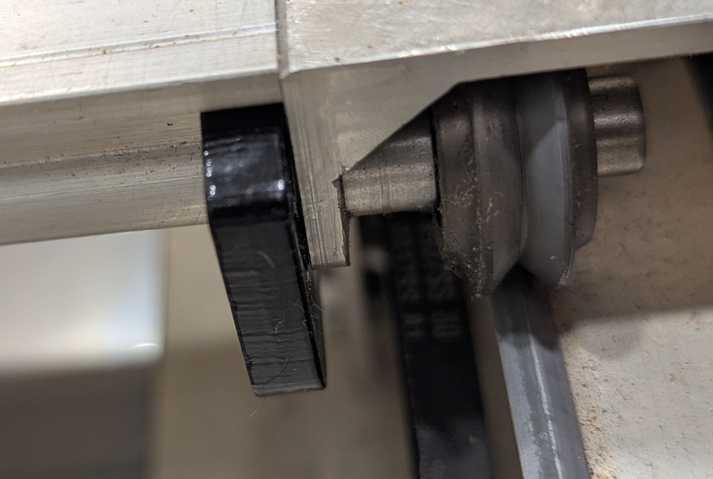
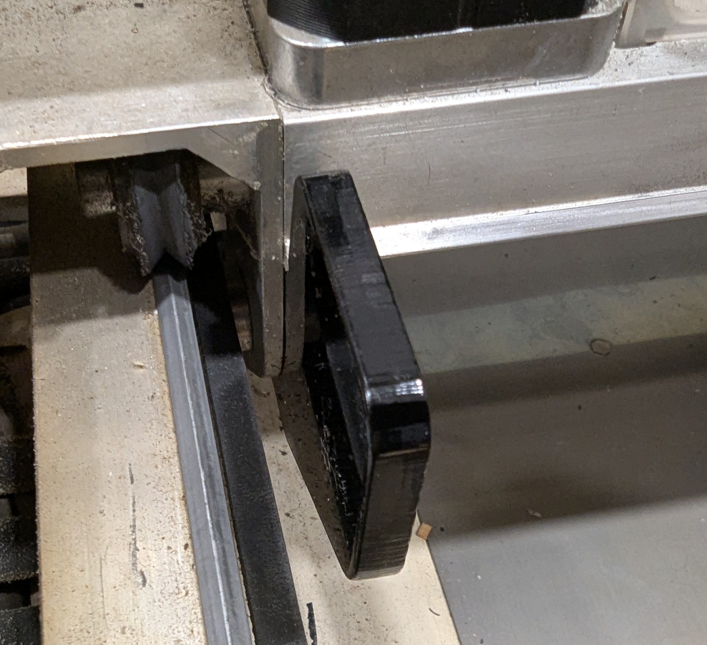
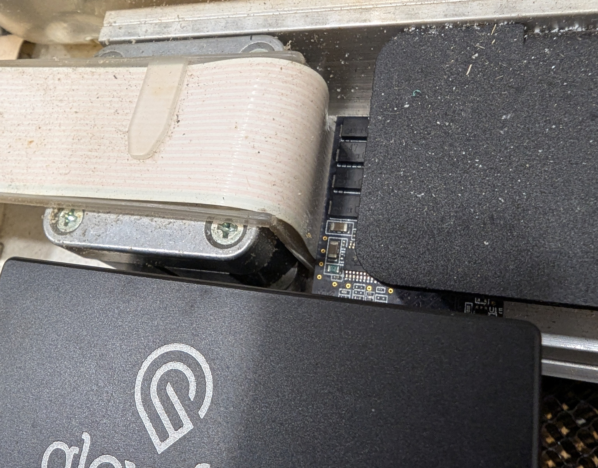
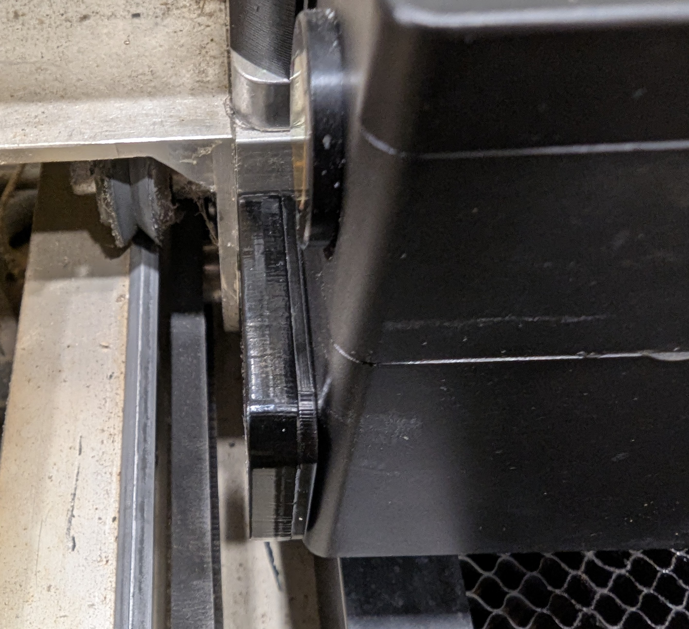
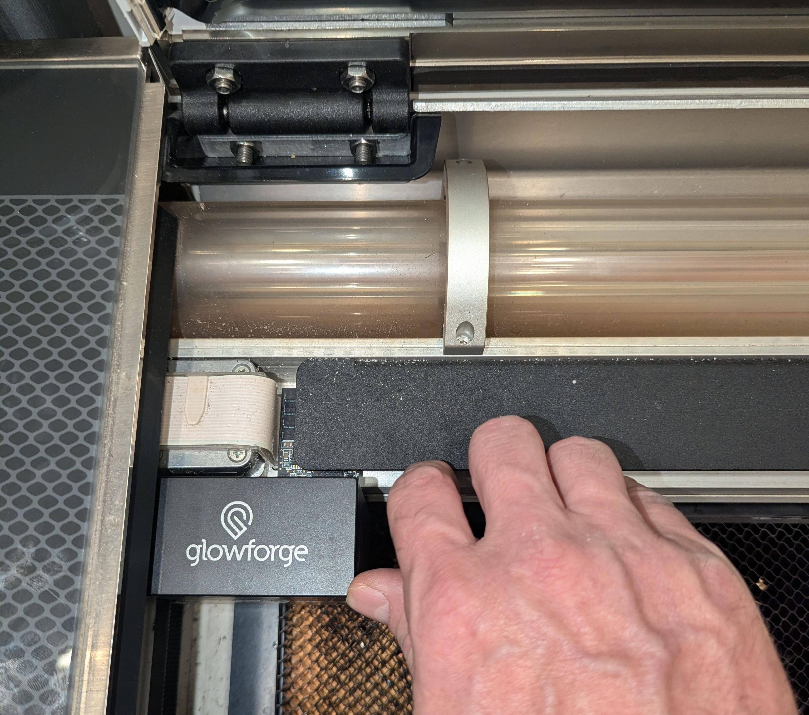

# Gantry stops

The gantry stops clip onto the gantry and keep it and the head from overtraveling. They are designed to safely stop excess travel of the gantry and the head in every direction. We recommend them for GRBL mode and cloud mode.

!!! note

    These were designed and fitted to the [bench reference](../technical/machine/index.md#the-bench-reference). If they do not fit your machine, ask on the [community forum](https://community.openglow.org) for help.

## Files to cut

Before you install ForgeFIRM, cut the following parts with your laser:

- [Gantry stop](../assets/images/gantry-stops/gantry-stop.svg){ download }: .25" (6 mm) acrylic. You'll need two.
- [Spacer](../assets/images/gantry-stops/gantry-stop-spacer.svg){ download }: .125" (3 mm) or .25" (6 mm) acrylic (see the instructions below). You'll need one.

## Installation

### Step 1

With your machine powered off and the crumb tray removed, move the gantry to the middle of the cutting area. On the right side of the gantry, hook the back side of the gantry stop to the slot on the rear of the gantry, about 1/2" (10 mm) to the left of the side plate:

{ loading=lazy }

### Step 2

Place your fingers under the front of the gantry stop and your thumb on top of the gantry. Gently squeeze until the gantry stop clicks into place:

{ loading=lazy }

### Step 3

Reach under the gantry, place your fingers behind the side plate, and press the gantry stop toward the side plate until it locks into position:

{ loading=lazy }

### Step 4

The entire surface of the gantry stop should be flush against the side plate:

{ loading=lazy }

### Step 5

Repeat the process for the left side:

{ loading=lazy }

### Step 6

Move the head to the left and press it against the left gantry stop. With the head against the stop, the head's circuit board must not touch the white ribbon cable.

{ loading=lazy }

### Step 7

If the head's circuit board touches the white ribbon cable, glue a spacer of the right thickness (.125" to .25", 3 mm to 6 mm) to the right side of the left gantry stop, so the board clears the cable.

{ loading=lazy }

### Step 8

Move the gantry and the head to each end of their travel. At every end, a gantry stop takes the contact, and the head never touches the cabinet or any cable.

{ loading=lazy }

## Removal

To remove a gantry stop, reverse steps 1 to 3.
