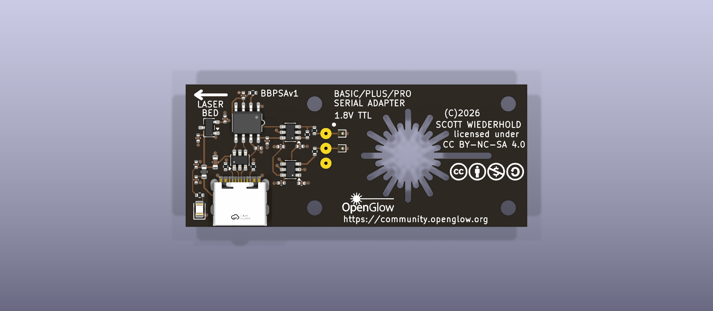
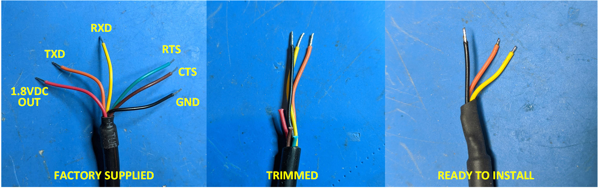
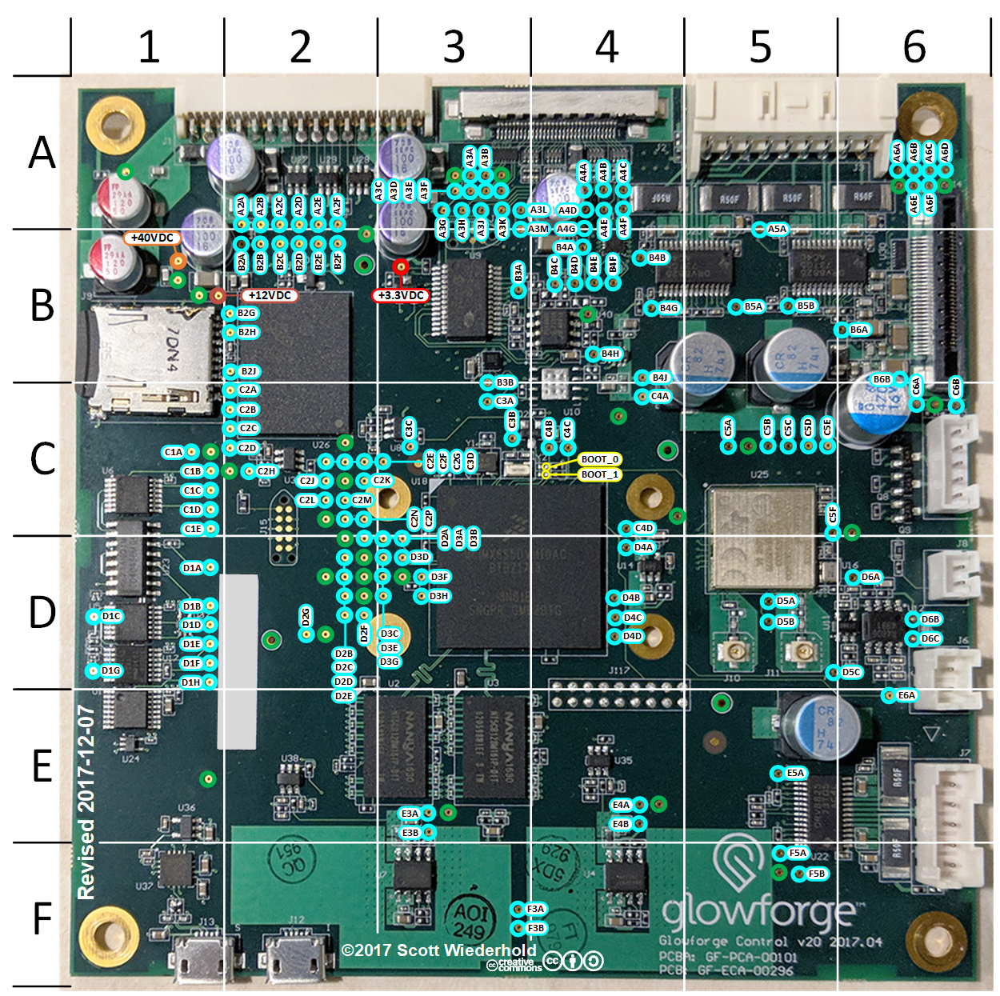
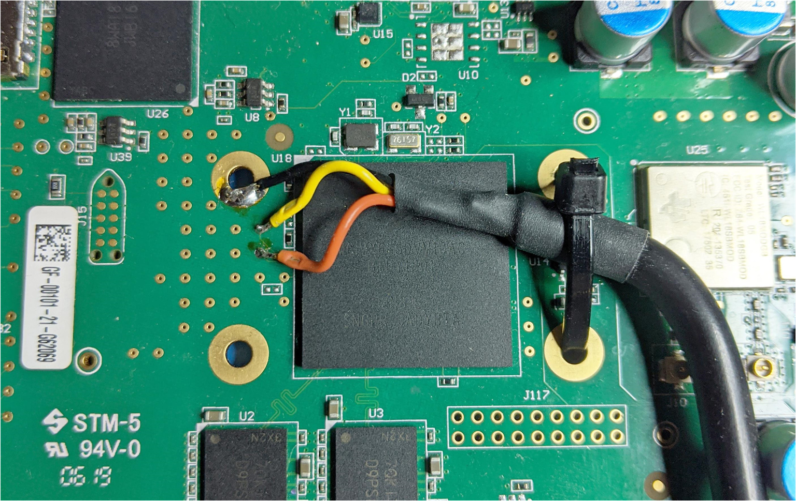

# Serial access

The install runs at the serial console of the control board, because the
factory firmware offers no SSH. This page tells you the three ways to reach
that console: the Micro-USB port that early machines have, the OpenGlow
serial adapter, or a soldered FTDI cable.

!!! danger "1.8 V only"

    The console domain of the control board is 1.8 V. **Never connect a
    3.3 V or 5 V adapter to these test points.** Anything higher than 1.8 V
    irreversibly destroys the control board.

The console settings are **115200 8N1** in every case. Select a color
terminal with UTF-8 encoding for the best experience from ForgeFIRM (PuTTY
works well). The console test points and their nets are in
[Buses](../technical/machine/buses.md).

The console login is `root` with no password, on the factory firmware and
on ForgeFIRM alike. On ForgeFIRM root works at the console only: SSH refuses
root, and the panel's account opens SSH
([The control panel](../usage/control-panel.md#login)).

## Machines with a Micro-USB port

Older Glowforges have a Micro-USB serial port connector on the control
board: J13, in the lower left of the control board in the test-point picture
further down this page. If you are fortunate enough to have one of those
units, plug it into your PC. It is a standard
[FTDI FT230](https://ftdichip.com/products/ft230xq/) serial-to-USB adapter,
and the driver is included in most operating systems.

## The OpenGlow serial adapter (BBPSAv1)

The OpenGlow serial adapter 
is a USB-C serial-console adapter for the Glowforge Basic, Plus, and Pro
control board. It mounts onto the board with snap-in supports and contacts
the i.MX6 console test points (D3B, D3D, GND) through three spring-loaded
pins: **no soldering to the machine**.

### What it does

- **USB-C to 1.8 V TTL serial**, 115200 8N1, built on the WCH CH9101N.
- **Safe to leave mounted.** The target-facing pins go high-impedance
  (2 µA or less) when the adapter is unpowered, so the machine boots
  normally with the adapter in place and the USB cable unplugged. Two
  SN74LVC1T45 level translators with VCC isolation are what make that true.
- **1.8 V only on the machine side**, with 1 kΩ series resistors and
  GND-referenced TVS diodes on both signal pins.

### Status

Coming mid-September 2026

### Installation

The installation notes, with photos of an actual install, are planned. They
cover the snap-in supports, the orientation (the `LASER BED` arrow and the
pin-1 dot), the pre-mount checks from DESIGN.md section 10, and the
host-side driver setup. Two things do not change:

- **Never connect a 3.3 V or 5 V adapter to these test points.** The console
  domain is 1.8 V; anything higher destroys the control board.
- **Orientation matters.** Fitted end-for-end, the adapter's ground pin lands
  on the i.MX6's TX output. Confirm which end is ground with a meter before
  the first power-up.

### Host drivers

The CH9101N uses WCH's CH343 driver family: `CH343SER` on Windows and
macOS, `ch343ser_linux` on Linux. It can also enumerate as a plain CDC-ACM
device. The chip reports a unique serial number, so a `udev` rule can give a
specific adapter a stable device name.

## A soldered FTDI cable

If you have neither of the above, you can solder a cable to the test points.
First, you will need a soldering iron. No getting around that one. Next, you
need an FTDI
[TTL-232RG-VREG1V8-WE](https://www.ftdichip.com/Products/Cables/USBTTLSerial.htm)
USB to serial port adapter. **It is important that you get the 1.8 V
model.** If you get a 3.3 V or 5 V version you will irreversibly destroy
your control board. You can purchase this directly from FTDI, Amazon, or
most electronic supply shops.

When you receive your adapter, you'll need to prep it. Only three of the
lead wires are required. Trim the others, to unequal lengths, lest they
short out when you heat-shrink or tape them up.

You will be connecting to the microprocessor's serial console port test
points: RXD: D3B, TXD: D3D.

Solder the ground wire first, to the ground pad located to the upper left of
the microprocessor (see the picture below). Clip the leads for TXD and RXD
to no longer than a millimeter before soldering. This helps to avoid
unwanted contact with surrounding items.

After you've soldered all the leads, secure the cable to the PCB with a tie
wrap, as pictured. This is important. The test points will not stand much
mechanical stress, and will rip off the board easily. Don't worry, if this
happens to you, they are still accessible from the bottom of the board: a
second chance.

From there, connect the USB cable to your computer and fire up your favorite
terminal. The serial settings are 115,200 8N1.

!!! warning "Keep a soldered adapter powered"

    You will need to keep the serial port adapter powered on at all times
    when you are operating the Glowforge. If it is not powered, it draws
    down the 1.8 V bus on the control board and prevents it from booting. If
    you do not always have a computer nearby, plug it into a USB charging
    adapter.
