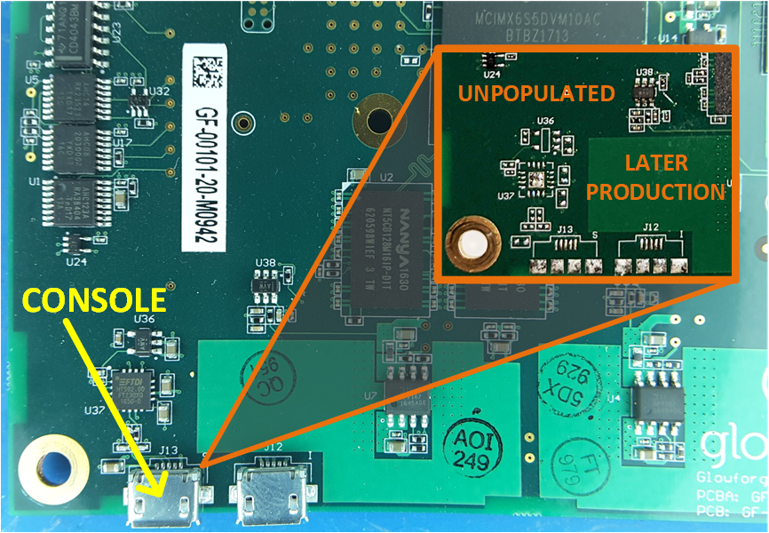
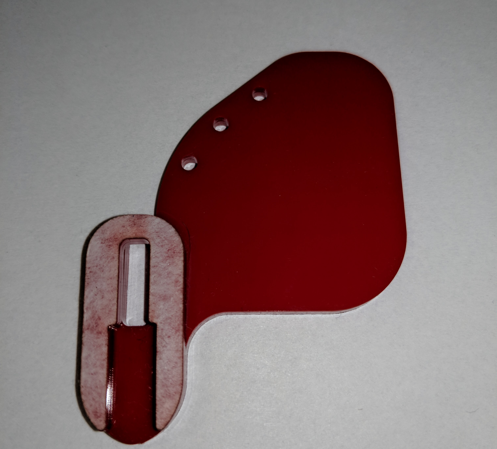
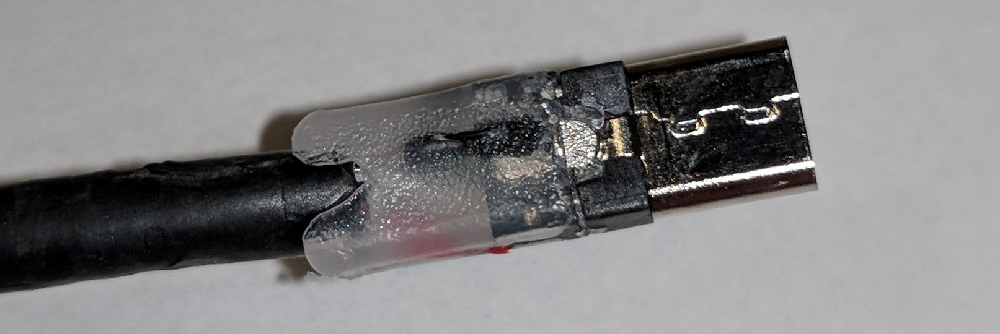
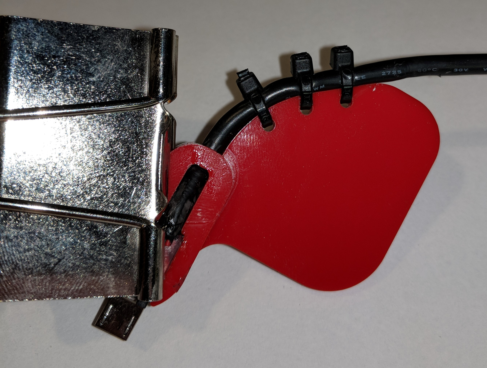
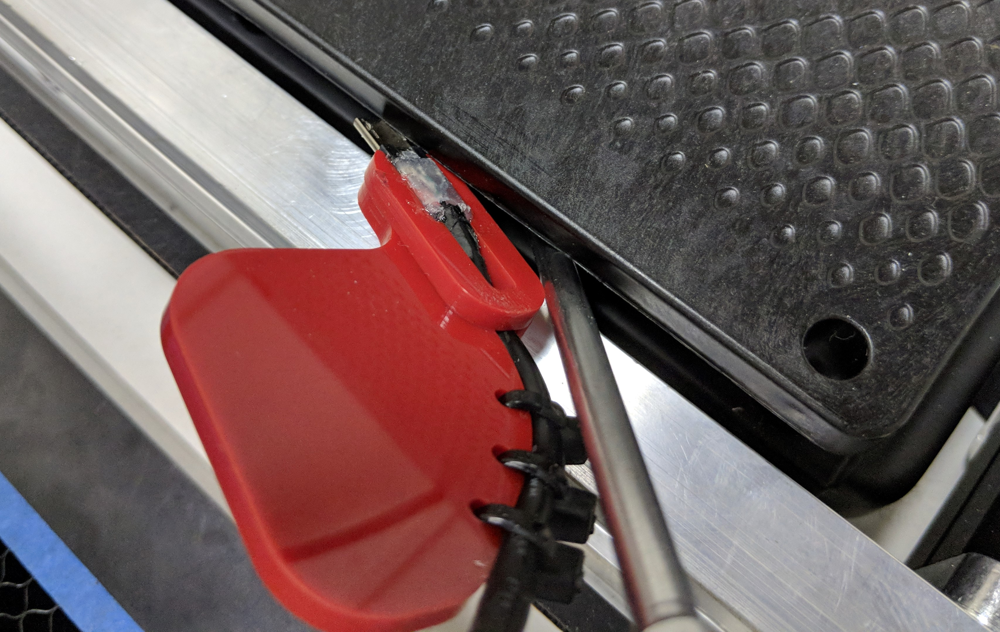
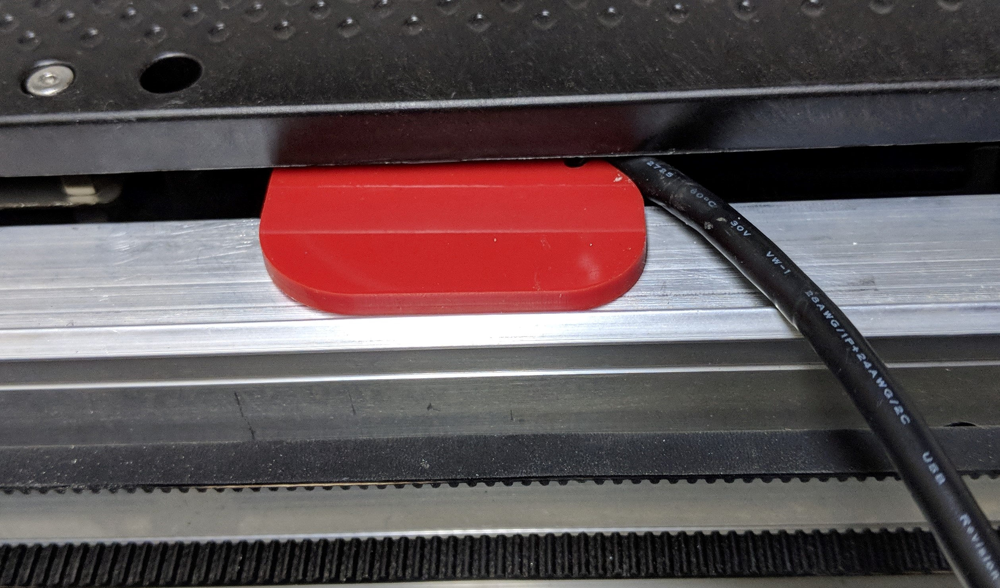
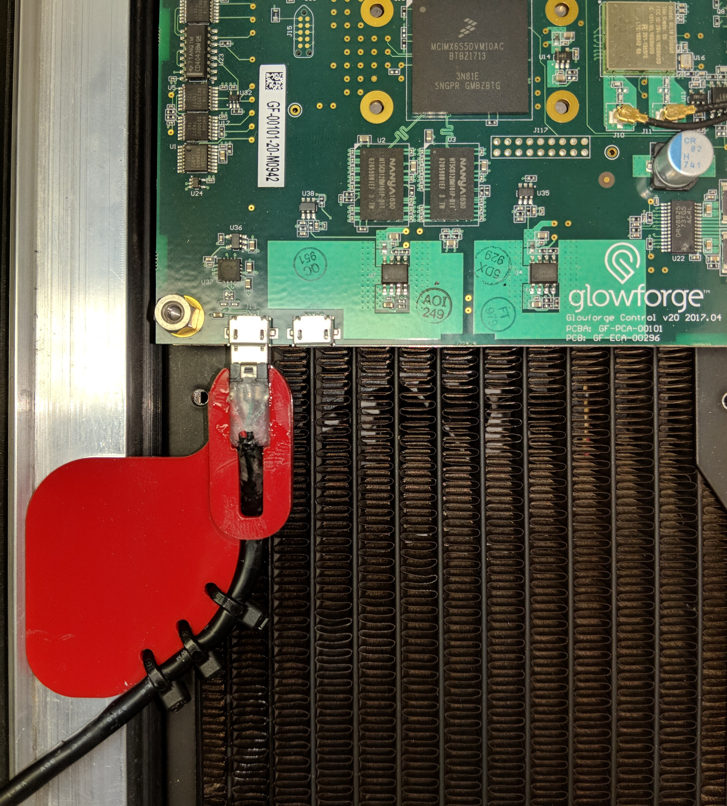

## Machines with a Micro-USB port

Original Glowforge units came with a Micro-USB serial port connector on the control
board. This was feature was no longer included [starting in early 2018](https://community.glowforge.com/t/heads-up-new-run-of-boards-will-not-have-the-usb-connector/18741). You should be able to see if it is there 
by looking under the plastic shell covering the control board.

If you are fortunate enough to have one of those units, plug it into your PC. It is a standard
[FTDI FT230](https://ftdichip.com/products/ft230xq/) serial-to-USB adapter, and the driver is included in most operating systems.

To access it, you will either need to remove the plastic shell covering the control board, or you can make 
the adapter described below.

### Sneaky Route

Using your Glowforge, cut [these](../../assets/images/serial-access/FactoryUSBAdapterJig.zip) out of .125" (3mm) acrylic, and glue them together like so:

Carefully cut off the boot of a standard micro-USB cable's connector:

Glue the connector to the adapter (wide end up as shown in the picture), using a binder clip to hold it in place while the glue cures. Secure the cable using zip ties:

To use, gently lift the edge of the plastic shell, and insert the jig under:

Align the outer edge of the adapter with the raised edge of the rail, and slide toward the back of the machine until you feel the USB connector lock into the board:

Here is what is looks like without the shell:

