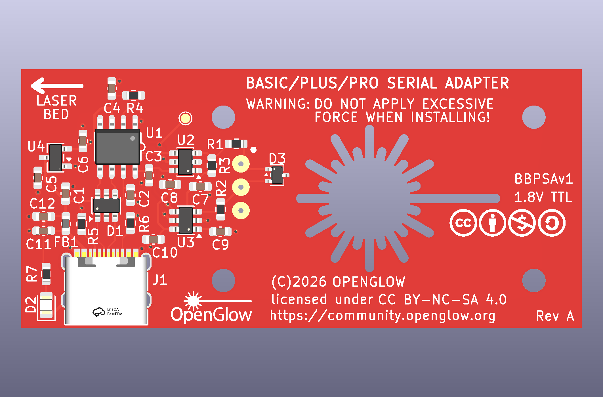
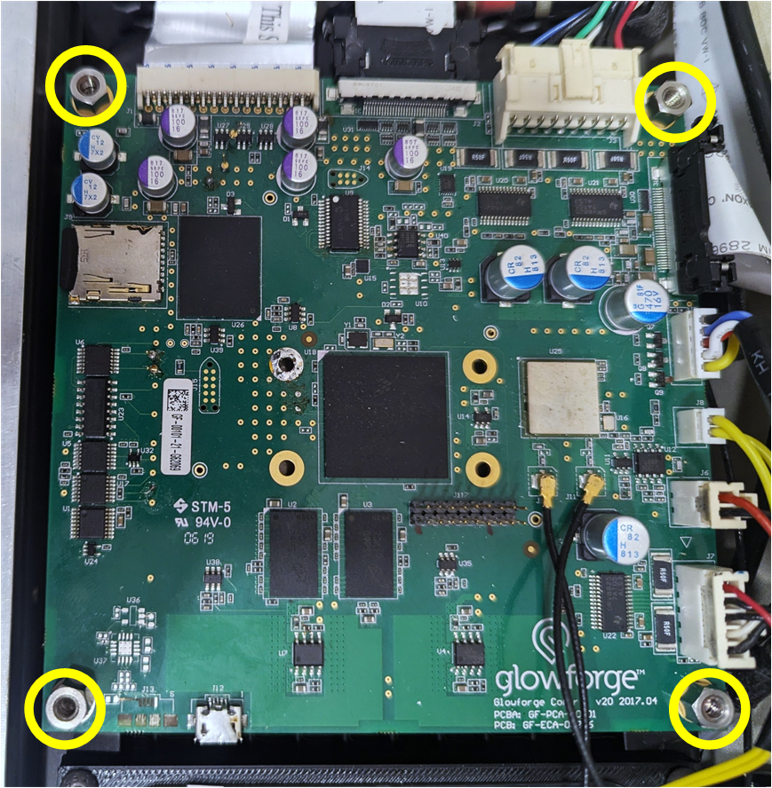
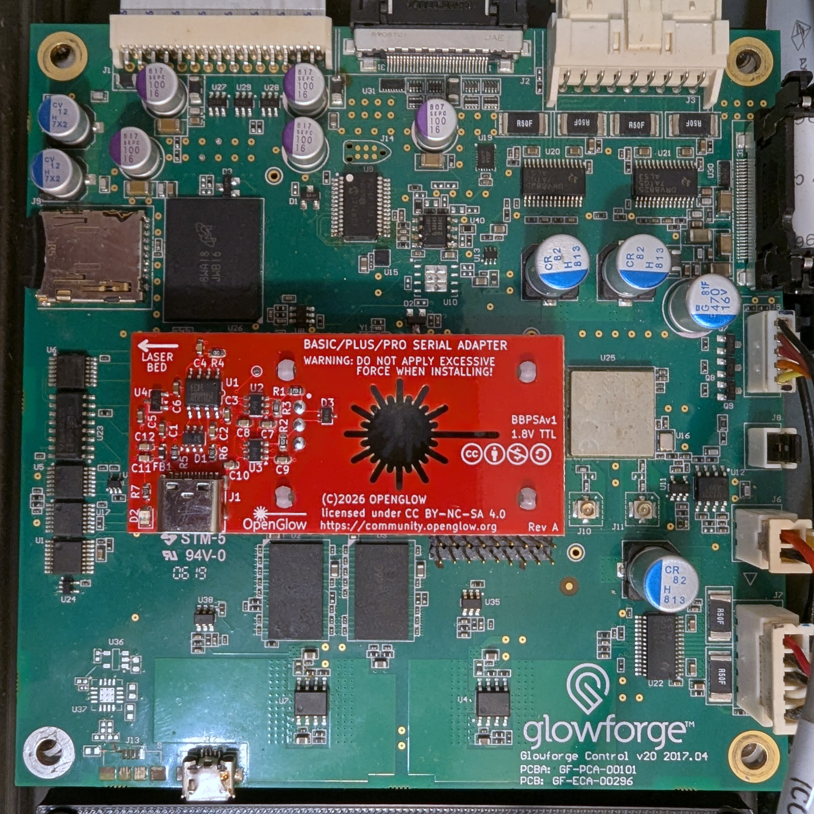
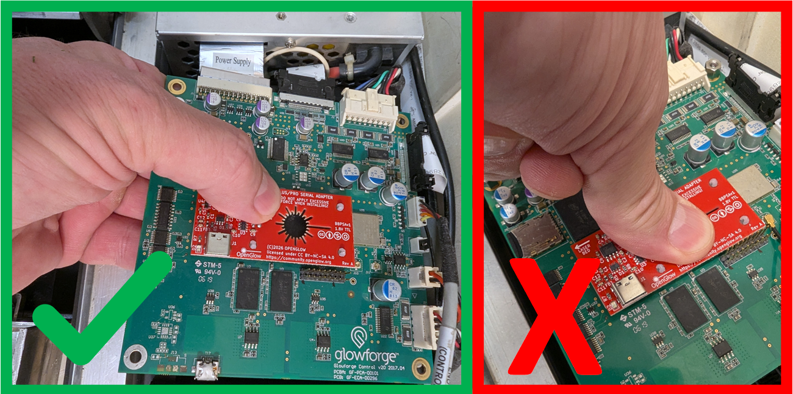
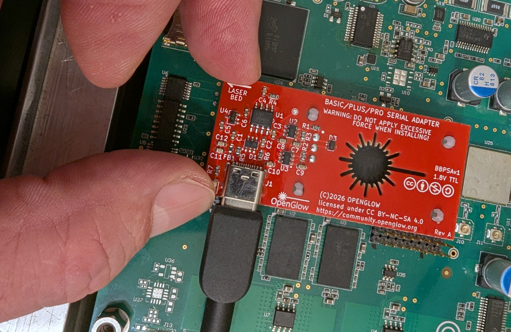

The [OpenGlow Console Adapter](https://www.amazon.com/dp/B0HJNS73KF) 
is a USB-C serial-console adapter for the Glowforge Basic, Plus, and Pro
control board. It is available for purchase on Amazon, the sale of which helps to 
support the OpenGlow project and the development of ForgeFIRM. It mounts onto the 
board with snap-in supports and contacts the i.MX6 console test points through 
three spring-loaded pins: **No Soldering to the Machine**.

### What it does

- **USB-C to 1.8 V TTL serial**, 115200 8N1, built on the WCH CH9101N.
- **Safe to leave mounted.** The target-facing pins go high-impedance
  (2 µA or less) when the adapter is unpowered, so the machine boots
  normally with the adapter in place and the USB cable unplugged.
- **1.8 V only on the machine side**, with 1 kΩ series resistors and
  GND-referenced TVS diodes on both signal pins.

### Installation

!!! danger

    READ THESE INSTRUCTIONS THOROUGHLY BEFORE INSTALLATION!  
    Failure to do so can result in permanent damage to your control PCB.

First step is removing the right side cover. There are a number of 
[videos](https://www.youtube.com/watch?v=s1lMoY62Wog) out there that explain this process, 
so we won't cover it here. After you have removed the right cover, remove the black plastic 
shell that covers the control circuit board. Remove the four screws from the corners of the 
control board:

GENTLY place the OpenGlow adapter on the control board, with the arrow pointing towards the laser bed, 
and align the standoffs with the four holes on the control board. **DO NOT APPLY FORCE**:

Place your hand under the control board. While support the control board from behind, gently press the 
standoffs into the holes on the control board until they click into place. **DO NOT PRESS DOWN WITHOUT SUPPORTING THE BACK OF THE CONTROL PCB**:

When inserting and removing the USB cable, support the adapter board to prevent loosening of the standoffs:

Reinstall the mounting screws for the control PCB and the right side cover. You can leave the plastic shell removed for easier access to the adpater.  

The adapter may safely remain attached when not in use.
