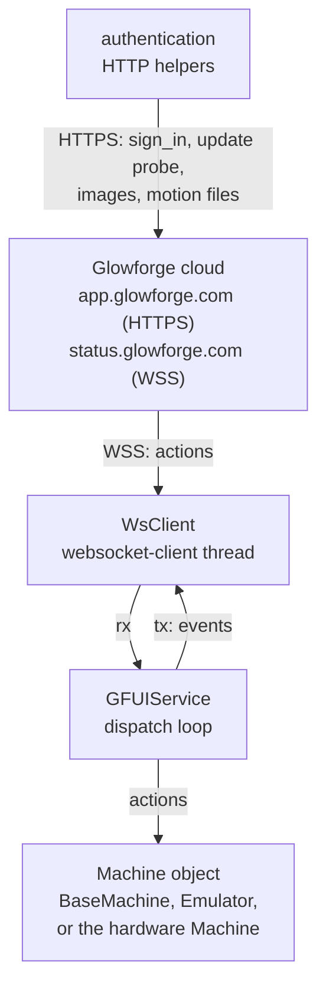

# Cloud mode

ForgeFIRM's optional **factory cloud mode** runs the machine under the
Glowforge web service: the machine signs in with its own identity, names its
software to the service as `ForgeFIRM/<version>` through the User-Agent, and
uses the service the way a stock machine does; the Glowforge phone or web app
drives it end to end: connect homing, Set Focus, material imaging, and full
prints (button press, cut, return-home).
It is distinct from the `gfhome.py` one-shot, which borrows the service only
for a camera-referenced homing cycle ([Homing](homing.md)). This page
describes the components, the scope, how a job runs, the policies, and the
test levers.

- The operator's view (credentials, connecting, what works) is
  [Cloud mode](../../usage/cloud-mode.md).
- The wire protocol (connection and authentication, the wire format, the
  action table, the events, progress reporting, image upload) is
  [The cloud protocol](../machine/cloud-protocol.md).
- The pulse header tag table and the factory's own action behavior are
  [The factory firmware](../machine/factory-firmware.md).

!!! warning "The protocol is undocumented"

    The Glowforge protocol is undocumented and can change without notice.
    Each ForgeFIRM release validates cloud mode against one specific
    factory service and firmware version, the version it advertises as
    `MCov` (`2.6.0-2228`). forgectrl surfaces a compatibility warning when
    the live service moves past that baseline (see "Firmware-update
    policy").

## Components

| Piece | Role |
|---|---|
| `gfcloud.py` (`/usr/sbin`) | Full cloud-mode controller daemon. Spawned and supervised by forgectrl when `controller_mode = cloud` (the init script defers to the supervisor and remains a manual stop only); the pulse device arrives as a broker-inherited fd (`GF_PULSE_FD`) that is never closed, so job boundaries and mode switches do not cycle the 40 V rail. SIGTERM stops the service loop, tells a running action to stop and waits for it (no park on the way down), safes the hardware, and exits. |
| `gfhome.py` (`/usr/sbin`) | One-shot service-driven homing. Invoked for `$H` when `homing_mode = gfcloud`; dispatches with `allow_print=False` so a print can never run inside a homing session. Completion is guarded: a run of near-identical service corrections aborts (the machine is not physically moving), and quiet only counts as homed when the head accelerometer witnessed real motion during the session ([Homing](homing.md)). |
| `ffmachine.py` (site-packages) | Shared hardware-machine glue: identity overrides from the shared config, and the forgectrl-routed capture machine both clients use. |
| `gfutilities` | Protocol and service layer: auth, WebSocket client, action dispatch, settings report, pulse-file handling ([Glowforge-Utilities](https://github.com/openglow-org/Glowforge-Utilities)). |
| `gfhardware` | The hardware `Machine`: motion, laser latch, switches, cameras ([python3-gfhardware](https://github.com/openglow-org/python3-gfhardware)). Thermal hardware belongs to the forgectrl cooling engine: the cloud client reports job state (`POST /cool/state`, with the pulse header's run fan duties as the per-job profile) and enforces the published verdict on its fire path, gaining the flow verification and over-temp protection the engine provides ([The cooling engine](cooling-engine.md)). |

`gfhardware` is the Python library for accessing and controlling Glowforge
brand CNC laser hardware. Its repository's `forgefirm-app/` directory holds
the ForgeFIRM Glowforge web-service applications built on it: `gfhome.py`
(one-shot service-driven homing), `gfcloud.py` (the full cloud-mode
controller daemon, with its init script), and `ffmachine.py` (the shared
hardware-machine glue both use). They are not part of the `gfhardware`
Python package; the ForgeFIRM image recipes install them directly from that
directory.

### How the service layer works

`gfutilities` implements the machine side of the Glowforge cloud workflow:

- **Authenticates** a machine to the web service (`/machines/sign_in`) using
  its serial number and password, retrieving the session and WebSocket
  tokens. Every request and the WebSocket handshake carry the User-Agent
  from `SERVICE.USER_AGENT`: ForgeFIRM sets it to `ForgeFIRM/<version>` from
  the image stamp `/etc/forgefirm-version`, and the library's own default is
  `OpenGlow/<factory firmware version>`.
- **Checks for firmware** advertised by the service (a version probe only;
  see "Firmware-update policy").
- Opens the **real-time WebSocket control channel** to the status service
  and reacts to the service's *action* messages.
- **Emulates** a machine's responses: it reports the full machine
  **settings** schema, uploads camera images, downloads and parses **motion
  ("pulse") files**, and emits the lifecycle **events** the service expects
  (`:starting`, `:capture:*`, `:upload:*`, `:completed`, and so on).
- Provides helpers for working with the **pulse byte-stream** format
  (decoding motion statistics, generating simple linear moves).

It works over the protocol's two channels, HTTPS and the WebSocket, exactly
as the factory machine does
([The cloud protocol](../machine/cloud-protocol.md#two-channels)); it uses
`requests` for the first and `websocket-client` for the second.

<div class="diagram" style="--diagram-min: 0" markdown>



</div>

`GFUIService` owns the receive and transmit queues and dispatches each
incoming action to the machine object. The machine performs the work
(capture, upload, download, motion) and pushes status events back onto the
transmit queue, which the `WsClient` drains to the service. The details of
each channel are on [The cloud protocol](../machine/cloud-protocol.md).

### Camera captures

Camera captures route through forgectrl's snapshot endpoint (it owns the
imx-media pipeline whenever a stream is open; the snapshot works during an
active stream and takes a per-shot lamp override), with direct V4L2 capture
as the fallback when the daemon is unreachable.

**The cameras only capture with the lid closed.** This is a privacy rule,
not a factory behavior. Both capture paths enforce it (forgectrl answers
`409` and the direct fallback raises `gfhardware.cam.LidOpen`), and the check
fails closed ([The video pipeline](video-pipeline.md)). A refused image
action is reported to the service as `<action>:failed`, so it resolves
rather than hanging, and the client does not fall back to a direct grab that
would refuse identically. **Consequence:** the factory runs focus hunts with
the lid open, and a hunt includes a head capture, so a hunt attempted with
the lid open fails; the lid must be shut before the app focuses or prints.

Head images are captured with the white torch off, because added white light
washes out the measure-laser dot the cloud's focus analysis needs.

## Scope: telemetry is excluded

The factory streams continuous telemetry; ForgeFIRM does not. Excluded
channels:

- `POST /api/sensor`, the binary sensor firehose.
- WSS `type:"log"` messages, the in-band advisory logs.
- The `fault:*` / `estop:*` / `interlock:*` **cloud reporting** namespace.
  (Local fault-to-safe handling is independent of reporting and fully
  active.)

On-demand requests are still answered: the `settings` report, image
captures, and the functional action handshake.

**One exception, deliberately kept: the progress frame.** The app's progress
bar rides a WSS `type:"progress"` frame the machine sends every 30 s during
a job ([The cloud protocol](../machine/cloud-protocol.md)). That is a UI
status update, not the sensor telemetry this section excludes, so ForgeFIRM
carries it. The bar is the operator's only sign a multi-hour print is
advancing; going dark for hours is not a scope we want. Everything else
above stays excluded, including inside that frame: of the fifteen periodic
tags the factory packs into it, ForgeFIRM fills the five that describe the
job (`CAid`, `CCbp`, `CCst`, `CCxp`, `CCyp`) and leaves the temperatures and
the IR readings out. The service already has this machine's settings
report; it does not get a sensor feed by the side door.

## Per-action settings

Actions carry a sparse `settings` dict (for lidar, a list of dicts),
normalized and made available to every image handler. Policy per key:

- **Honored:** `HCil` (head illumination) and `LCfl` (lid flash) are lighting
  the capture path can apply directly.
- **Deliberately not applied:** `HCex`/`HCga`/`HCae`/`HCag`: the
  factory-scale exposure and gain values use different units than the
  mainline camera controls and would mis-expose; per-camera defaults are
  used instead.
- The opening `settings` action can carry service-pushed values (for
  example the `NRic` network-retry family); ForgeFIRM reports its own values
  and the service tolerates that.

The service pushes very little outside the pulse header, and it is worth
knowing that before going looking for a setting that is not in one:
**the operating envelope reaches the machine only in the header, per job**
([The pulse header](../machine/cloud-protocol.md#actions) lists the seven keys
that ever arrive any other way, none of them thermal).

The other half of that: for the header fields the service does not override
with its own policy, what comes back is what this machine last reported. The
`MACHINE_SETTINGS` defaults are largely placeholders, so those fields
round-trip as placeholders. A field arriving as zero usually means ForgeFIRM
sent zero, not that the service has nothing to say. Nothing downstream
consumes them, but it does mean the service is not a source of truth for any
limit the machine itself declares.

## Jobs (motion and print)

### What is different about the motion path

In cloud mode the machine does not plan anything. The service sends a
**precomputed pulse file**, already resampled to the pulse-byte format
([The step engine](../machine/step-engine.md)), which the client downloads,
writes into the ring, and plays:

1. The service issues a print action with a URL for the motion data.
2. The client downloads it and validates the header before a byte reaches
   the ring.
3. The header's own parameters are applied: the machine tick (10 kHz for
   prints and hunts), the acceleration ramp, the Z step mode (`ZSmd`, 0 is
   full-step: the service's focus is a count of full steps up from its
   zero, 4 full steps below the hall edge), and the per-job fan duties,
   which are passed to the
   cooling engine as the run profile.
4. The lens is unlocked for the motion (`cnc/motor_lock` bit 3 clear) and
   its driver is set to the drive current (`head/z_current` 0); both go
   back at idle. With the idle lock left in place the service's focus
   steps would be counted and never made, and at the hold current the lens
   rises two steps into the service's ramp and stalls ([The motion
   hardware](../machine/motion-hardware.md#the-lens-and-its-travel)).
5. The button wait arms the laser, exactly as in GRBL mode.
6. The ring plays to the end; the client supervises it and reports state.

There is no live re-planning. The ring is filled before the button is asked
for and topped up as it drains, so the ring size caps how much of a job is
buffered at once, not how long a job may be (below).

### How a job runs

- The pulse file at `motion_url` is downloaded and written into the kernel
  pulse-device ring, then run. The dead-man flock is held on one fd for the
  whole job; process death fires the kernel dead man's switch
  ([The pulse-feeder contract](pulse-feeder-contract.md)).
- The job is supervised the way the factory firmware supervises it. The
  hardware chain kills the beam on the lid and the interlock loop by itself;
  the client decides what motion and the job do, reacting on the switch
  edge (the switch thread wakes the run loop; the level read every 100 ms is
  the backstop). The client takes no `EVIOCGRAB` on the switch device.
    - The lid or interlock loop opens during a print or motion, or the
      service cancels it: controlled stop (`cnc/stop`, position kept), job
      canceled; a print then parks (with the lid open, if it is) and
      reports the cancel. The park first drops
      what the job left in the ring (the rest of an aborted print, or the
      whole print after a cancel at the button wait), the factory's
      "clearing pulse data", so nothing plays ahead of it; a job that never
      moved parks nothing. The feeder is stopped before that clear, on every
      way out of the job (a cancel, a blocked verdict, a timed-out button
      wait, a crash): a print longer than the ring parks its feeder on a
      full ring with the rest of the print in hand, and one left alive
      would refill the ring behind the clear. The park refuses to run with
      a feeder alive.
    - The lid or interlock opens during the pre-print button wait: latch
      relocked, job canceled; a press with the lid open never arms.
    - **The cooling verdict**, per the engine's contract
      ([Cooling engine](cooling-engine.md)), the same as the GRBL
      controller: `fire_ok=false` locks the laser latch at once; `hold`
      pauses the print the way the button does (controlled stop, laser-off
      backtrack, `print:paused`) and `resume_ok` resumes it with the latch
      back and the laser lead; a hold that stands longer than
      `cloud_hold_max_s` (default 1800 s) cancels the job, since the fail
      tiers never offer a resume. A verdict that goes missing (the engine
      gone with the laser armed) locks and holds, turns the check heater
      off, and writes the run airflow once. Before the run, a print whose
      armed session opens under a hold (`WARMUP`, `COLD`, a hot loop) waits
      it out the same bounded way; only an absent engine refuses to arm.
      That wait also holds until the engine's own `armed` flag comes back in
      the verdict, so a print never starts on the verdict computed for the
      idle session before its arm, which would read clean while the fans
      were still at their idle duty. Motions and hunts are not armed and are
      not held.
    - The kernel leaves the run on its own (a fault, a disable): the job
      ends canceled, never completed, and a park that faults reports no
      success; the service re-hunts rather than dead-reckon from a position
      the head never reached. The failsafe cleanup after every action runs
      each of its steps (stop, latch, feeder, idle report) whatever the ones
      before it did: a stop the kernel refuses in a fault never skips the
      latch relock.
    - A hunt ignores the lid (lens travel plus the service's XY hunt
      pattern).
    - **The button pauses and resumes a print**: press, then controlled
      stop, then `cloud_pause_backtrack_ticks` (default 2000) ticks backward
      with the laser off, `print:paused`; press again, then forward with the
      laser re-enabled after `cloud_resume_lead_ticks` (default 1950),
      `print:resumed`. What the two counts really say is that the beam comes
      back on 50 ticks before the point the pause stopped at, over ground
      the job already cut, and that is the invariant the client keeps: the
      retrace is sized to `cnc/max_backtrack`, the history the ring still
      holds, and the lead follows it down. A pause in a print's first
      moments therefore retraces a little and leads a little, rather than
      failing; a live-fed print pauses exactly like a preloaded one, because
      the ring's retained gap is history whether the job was preloaded or is
      being fed. The laser latch stays unlocked and the armed window open
      through the pause (HV_ENABLE drops by itself when the stream stops,
      and the resume lead covers its re-arm); lid, interlock, or a service
      cancel while paused cancel the job from where it stands. Motions and
      hunts do not pause. Both tick counts are `forgefirm.conf` keys.
    - **A live feed that wedges holds the job the same way.** A feeder with
      room in the ring in front of it and no progress behind it is not
      feeding, and left alone it ends one way: the ring plays out what it
      holds, tens of minutes at the print tick, and then goes dry, which is
      an underrun, a position no longer trusted, and a job that cannot be
      picked back up. Thirty seconds of that is enough to stop the machine
      cleanly and retrace, which is done while there is still history to
      retrace over. If the feed moves again within a minute the job resumes
      over ground it already cut, seam hidden, `print:paused` and
      `print:resumed` reporting it exactly as the button pause does; if it
      does not, the job is canceled rather than left stopped in the
      material. A feed that stalls repeatedly (three holds) is canceled
      rather than cut in pieces, and a full ring is never mistaken for a
      stall. A press during a hold is not lost: pausing a stopped job is not
      a thing the machine can do, so the press is read once the job is
      moving again.
- Post-action cleanup always locks the laser latch and drops the
  pulse-device registration, including when an action crashes.
- A job larger than the ring runs anyway: the client holds the compressed
  body in memory, fills the ring before the button is asked for, and tops it
  up as it drains, so the ring is a window onto the job rather than the
  place the job lives. The ring size caps how much of a job is buffered at
  once (~56 min at the print tick), not how long a job may be.
- What does have a ceiling is the memory that body sits in. The client
  refuses a job whose declared length is past `pulse_reject_threshold_bytes`,
  before it takes a byte, and abandons a download that runs past it whatever
  was declared, because a service that declares nothing (or declares
  wrongly) must not be handed all the memory there is. A refusal is logged
  as `refusing the job:` with the size and the limit, so it reads
  differently from a transport failure, and the print is reported canceled
  like any job that never moved. `pulse_warn_threshold_bytes` only logs. Both
  are memory guards and neither is a ring guard: they say nothing about how
  long a job may be. The defaults (32 MiB warn, 128 MiB refuse) are reasoned
  rather than measured, because at the compression the service actually
  uses 128 MiB of body is days of cutting and nothing has come near it;
  every job logs the body it arrived as and the program it played, so the
  ratio the guards are sized against is on record should a job ever get
  close.

On the wire, a canceled or refused print is reported as `:cancelled`; a job that never moved ends that way too, never as `:completed`. <!-- style: ignore -->

### Header enforcement

Every pulse file opens with a header: the job's operating envelope, a flat
list of 4-character tags. The tag table and each tag's disposition are on
[The factory firmware](../machine/factory-firmware.md). What ForgeFIRM does
with it:

- **Refuses on** `MCsn` (the serial the job is locked to) and `PDfm` (the
  pulse-data format), both checked before a byte reaches the ring. A
  mismatch is `refusing the job:` in the log and a cancel to the service.
- **Applies** the step frequency, the stepper currents (running and idle),
  the decay and microstep modes, and the Z mode. The microstep mode is the
  header's, the service's own ×8, whatever the `xy_microsteps` setting says:
  the service plans every stream at ×8 for this machine type, so cloud mode
  runs at that scale, and a header at any other mode is **refused** with the
  serial and format checks, before a byte reaches the ring (`refusing the
  job:` in the log, `:cancelled` to the service): a stream at a finer mode <!-- style: ignore -->
  is one this machine has never run in cloud mode, and the report of such a
  refusal is what starts that work.
- **Hands the run-phase fan duties** (`AArd`, `EFrd`, `IFrd`) to the
  forgectrl cooling engine as the per-job profile, on the scale the service
  uses (air assist 0 to 1023, exhaust and intake 0 to 65535). While the laser
  is armed the engine raises any of them to its configured run duty, so a
  print's fans never run slower than the cut profile, while a hunt's `0`
  duties stand and the hunt is measured, not judged.
- **Passes through** the coolant window (`CMrx`, `CMrn`) and the tach floors
  (`EFrx`, `IFrx`, `AArx`) on every `POST /cool/state` while the job is
  loaded. The engine applies each only where it is stricter than its own
  configured value, never looser, and never to a gate the operator turned
  off. A sentinel or an absurd value is dropped.
- **Logs** the lifecycle keys (`CFrh`, `CCwp`, `CCrp`, `CCup`) in every job's
  log line; they drive nothing, which is what the factory does with them.
- **Counts the rest.** Each job names its lifecycle keys, counts the keys
  with no applier, and splits that count into *declared ignored* (a
  decision with a reason) and *undecided*: `N of M header keys have no
  applier here (D declared ignored, U undecided)`, the undecided ones named
  at debug level. The undecided count is the one that should be zero.

Thermal policy is the cooling engine's, on purpose: it runs its own coolant
ceiling and critical line, flow verification, airflow gates, emission
witness, and silence timeout, and a remote service can tighten those limits
for a job and never loosen them ([The cooling engine](cooling-engine.md)).

### The warm-up and the rest

ForgeFIRM holds twice around a print, as the factory does, and for the same
reason: the two periods, what they are for, what the factory was measured
doing, and why the pulse header's lifecycle keys are not their source are on
[The factory firmware](../machine/factory-firmware.md#a-prints-warm-up-and-its-rest).

`MOTION.WARM_UP_DELAY` and `MOTION.COOL_DOWN_DELAY` carry the seconds and
default to the factory's measured periods. 0 skips either, deliberately, and a
skipped period says so in the log rather than passing in silence: a
configuration that carries explicit zeros keeps them until someone changes
them.

## Firmware-update policy

ForgeFIRM **never downloads or installs factory firmware.**

- The `update_check` action is answered with `update_check:completed`, which
  is what a factory machine sends once it has started its updater, without
  the hand-off that would install a factory image over ForgeFIRM. A version
  probe that fails answers `update_check:failed`, the one honest failure
  here: the check itself did not happen.
- On connect (when `FACTORY_FIRMWARE.CHECK` is set) a read-only
  `GET /update/current` probe records
  `{latest_gf_version, tested_against_gf, checked_at}` to
  `FACTORY_FIRMWARE.STATUS_FILE` (`/data/forgefirm/gf-latest.json`).
- forgectrl reads that file and shows a **compatibility warning** whenever
  the live service has moved past the tested baseline, regardless of whether
  a newer ForgeFIRM exists, plus an **upgrade recommendation** only when one
  does. The factory `.fw` is never offered.
- `tested_against_gf` is `FACTORY_FIRMWARE.FW_VERSION` from the client's
  configuration: the factory firmware version this build advertises as
  `MCov` and is tested against. There is no separate release-side field: the
  value travels from the config to `gf-latest.json` to forgectrl's status
  (`gfsvc`) to the panel banner.
- One caveat on that probe: `/update/current` comes from the 1.x-era client
  and appears nowhere in the 2.6.0 application, which reaches its updater
  through the service action instead. The endpoint answering is an
  assumption, not something the current factory firmware demonstrates.

The two refused actions, `factory_reset` and `head_firmware_update`, and
what the factory does with all three unprompted actions, are on
[The factory firmware](../machine/factory-firmware.md).

## Configuration

The operator's procedure for the credentials and the panel fields is on
[Cloud mode](../../usage/cloud-mode.md). The files and keys:

| Where | Keys |
|---|---|
| `/data/etc/gfhome.conf` (seeded from `/etc/gfhome.conf.sample`) | `SERVICE.*` (server and status URLs, and `USER_AGENT`: the User-Agent the service sees, default `ForgeFIRM/<version>` with the version from `/etc/forgefirm-version`), `FACTORY_FIRMWARE.CHECK` / `STATUS_FILE`, `FORGECTRL.URL`, `LOGGING.SAVE_PULS` / `SAVE_SENT_IMAGES` (both default off) and `LOGGING.CAPTURE_DIR` (default `/data/forgefirm/captures/<app>`), `MOTION.*` (including `WARM_UP_DELAY` and `COOL_DOWN_DELAY`), `THERMAL.*`. |
| `/data/forgefirm.conf` (managed from the forgectrl UI) | `controller_mode` (`grbl` / `cloud`, read by the forgectrl supervisor, which spawns exactly one controller at boot and on every mode switch; the init scripts defer to it), `homing_mode`, identity overrides `gf_serial` / `gf_password` (a serial override re-derives the hostname), the pause pair `cloud_pause_backtrack_ticks` / `cloud_resume_lead_ticks`, the cooling-hold bound `cloud_hold_max_s`, the download guards `pulse_warn_threshold_bytes` / `pulse_reject_threshold_bytes` (bytes of compressed body held in memory, unset = 32 MiB warn and 128 MiB refuse, 0 lifts either), and the log levels `log_gfcloud_disk` / `log_gfcloud_remote` and `log_gfhome_*` (each `off`..`debug`; read at process start, so applied at reboot). |

### The gfutilities configuration file

The library and its emulator are driven by an INI-style configuration file.
Configuration is parsed by
[`gfutilities/configuration.py`](https://github.com/openglow-org/Glowforge-Utilities/blob/master/gfutilities/configuration.py):
section and option names are upper-cased into flat `SECTION.OPTION` keys, the
literal strings `True`/`False` become booleans, and `%(name)s` interpolation
is supported within a section.

| Section | Key | Purpose |
|---|---|---|
| `[SERVICE]` | `server_url` | HTTPS API base (default `https://app.glowforge.com`). |
| | `status_service_url` | WebSocket control URL (`wss://status.glowforge.com`). |
| | `user_agent` | The User-Agent the service sees (default `OpenGlow/<fw_version>`). |
| `[MACHINE]` | `serial`, `password` | **Credentials** the machine signs in with (below). |
| | `hostname`, `head_id`, `head_serial`, `head_firmware` | Optional identity overrides reported in the settings report. |
| `[FACTORY_FIRMWARE]` | `check` | Whether to query the advertised firmware version. |
| | `download_dir` | Where downloaded firmware would be written (ForgeFIRM never downloads it). |
| | `fw_version`, `app_version` | Optional reported-version overrides. |
| `[EMULATOR]` | `base_dir` | Root for the emulator's resource folders. |
| | `image_src_dir` | Canned camera images (`HOME_1..4.jpg`, `HEAD_*.jpg`; an optional `LID_IMAGE.jpg` overrides `HOME_4.jpg` as the plain bed image). |
| | `motion_dl_dir` | Where downloaded motion and pulse files are written. |
| | `bypass_homing` | Experimental: start with the homing cycle skipped. |
| | `material_thickness` | Selects which canned head image to return. |
| `[LOGGING]` | `file`, `level`, `console_level` | Log file path and log levels (the example's handlers). |
| | `save_puls`, `save_sent_images`, `dir` | Optional debug captures of downloaded pulse files and uploaded images, written under `dir` (both off by default). |
| `[THERMAL]`, `[MOTION]` | | Additional tunables read from the config file. |

### The machine credentials

`serial` and `password` are derived from the i.MX6 OCOTP fuses on a real
Glowforge: the serial from `HW_OCOTP_MAC0`, and the password from
`HW_OCOTP_SRK0..7` (each read from `/sys/fsl_otp/`, the eight SRK words
concatenated as 8-digit hexadecimal). The hostname is the identifier shown
at the command prompt, in capitals. Reading them needs
[serial access](../../install/serial-access.md) to the board. On a ForgeFIRM
machine the clients read the fuse identity themselves, and `gf_serial` /
`gf_password` in `/data/forgefirm.conf` override it.

!!! danger "Never share your serial or password"

    They cannot be changed. Keep them secret.

## The offline service

`gfcloud.py --offline`, or a start while the marker file
`/run/gfcloud-offline` exists, runs the machine under gfutilities'
`OfflineService` instead of the web service: no sign-in, no WebSocket, no
network. A UNIX socket, `/run/gfcloud-offline.sock`, takes the service's
action messages exactly as the service would send them (one JSON object per
line: `id`, `action_type`, `status`, `motion_url`, `settings`) and hands
back every event the machine would have sent the service, one per line, to
every connected client; each event is also logged (`offline event: ...`).
The session the machine is given serves `file://` URLs, so a `print` whose
`motion_url` names a local pulse file loads it through the same header
check, pulse source, and run loop a service job takes, and sinks any upload
(an image capture completes without reaching anywhere). Everything
downstream of dispatch is the object graph the service drives; the service
itself is what is absent.

This is the lever the acceptance tests use to exercise the machine's print
behavior (the lid and interlock aborts, the button-wait cancel, a paused
print ended by the lid, a print longer than the ring) without an account, a
network, or a job designed in the app; the service protocol is proven
separately, by a real print and by the emulator
([Acceptance](../../developers/acceptance.md)). The marker is under `/run`,
so a reboot never comes up offline by accident, and the log carries
`OFFLINE service` while the client runs this way.

## The emulator in this machine's identity

`gfcloud.py --emulate`, or a start while the marker file
`/run/gfcloud-emulate` exists, runs the real service session with
gfutilities' `Emulator` in place of the hardware machine. The serial,
hostname, and password come from the fuses (or the shared config's
overrides) exactly as for the real client, the session signs in and opens
the WebSocket exactly as the real client does (the same `ForgeFIRM/<version>`
User-Agent), and every action the service
sends is answered the way the emulator answers it: canned frames for the
captures (the dev image's gfutilities fixtures under
`/usr/share/gfutilities/emulator/`, captured on a machine of this type with
the head at its home position), the pulse file downloaded and parsed
through the same path a job takes, and a print reported running and complete
without a button wait and without moving anything. Nothing is armed and
nothing moves; the pulse device is never opened. Like any controller under
forgectrl it reports its job state to the cooling engine, idle and unarmed
for as long as it lives, so the supervisor's mode switch completes on the
report the way it does for the real client.

This is the lever the acceptance tests use to prove the service protocol
(sign-in, the firmware check, the WebSocket, the hunt, the image uploads, a
print's download and lifecycle as the app sees them) with nobody at the
machine: only the app has to be driven. What it cannot prove is the machine's
side of a print (progress, the button wait, the pause, the aborts); those are
the real print and the offline tests. The real client must be down before
the emulator signs in (the service holds one session per machine), so the
tests stop the controller, set the marker, start it, and restart it without
the marker when done. Same marker rule as the offline service: under `/run`,
one start, never a persisted setting.

## Starting without the connect-time hunt

`gfcloud.py --no-hunt`, or a start while the marker file
`/run/gfcloud-nohunt` exists, sends the first settings report in the
reconnect form (no values). The service answers that form by keeping the head
position it already has instead of sending its connect-time hunt, which is
what the factory client does on every reconnect within a session
(gfutilities does the same: only a process's first report carries the
values). The log carries `NO-HUNT:` at the start. It is for a restart where
the service already knows where the head is, which is what the acceptance
tests do between tests that do not home; a fresh boot, the homing tests, and
the one real print report the values and get the hunt, because a print placed
on a stale head position can run the gantry into a rail. The offline service
has no hunt to skip and the emulator keeps its hunt, so the marker is ignored
under either.

The three markers share one rule: under `/run`, so a reboot never comes up
with one; read by the client that starts, and taken down by it, so a marker
applies to that one start and never to a respawn after it.

## Safety

The factory-experience client runs behind the same kernel latch, charge-pump,
backstop, and dead-man rules as GRBL mode ([The kernel module](kernel-module.md)).
The precomputed pulse file it loads is subject to the same FIRE gating as
the live stream. The button wait arms the laser exactly as in GRBL mode
([The grblHAL driver](grblhal-driver.md#the-armed-window)), and forgectrl
relocks the latch on every transition out of a running client
([forgectrl](forgectrl.md)).

## The gfutilities library

### Running the emulator standalone

Off the machine, the bundled
[`examples/gf-machine-emulator.py`](https://github.com/openglow-org/Glowforge-Utilities/blob/master/examples/gf-machine-emulator.py)
ties the library together into a runnable emulator. It responds to the
service with canned camera images and the downloaded motion files, so a full
homing, motion, and print cycle completes without any hardware attached.

Copy the sample configuration and edit it, then run from the `examples/`
directory so the relative `_RESOURCES` paths and the
`gf-machine-emulator.cfg` file resolve correctly:

```bash
cd examples
cp gf-machine-emulator.cfg.sample gf-machine-emulator.cfg
python gf-machine-emulator.py
```

The entry point parses `gf-machine-emulator.cfg`, configures logging, then:

```python
from gfutilities.configuration import parse
from gfutilities import GFUIService, Emulator

parse('gf-machine-emulator.cfg')
service = GFUIService(Emulator())
service.connect()   # sign in, probe firmware, open the WSS channel
service.run()       # dispatch service actions until interrupted
```

### The emulator's action sequence

Once connected, the service drives the machine through a sequence of
actions. The emulator handles each and replies with the appropriate events
(the factory sequence itself is on
[The factory firmware](../machine/factory-firmware.md)):

| Action | Emulator behavior |
|---|---|
| `settings` | Sends the full machine settings report (below). |
| `update_check` | Ignored. |
| `hunt` | Downloads the focus-homing pulse file; emits `hunt:starting` / `hunt:completed`. |
| `lid_image` / `head_image` / `lidar_image` | "Captures" a canned JPEG and **uploads it to the presigned storage URL** supplied in the action's `endpoint` field; emits `:capture:*` and `:upload:*` events. |
| `motion` | Downloads and parses the motion pulse file; emits `motion:starting` / `motion:completed`. |
| `print` | Downloads the print pulse file, waits for the button, then emits the warm-up, running, return-to-home, and completed events. |

### Project layout

```
Glowforge-Utilities/
├── gfutilities/
│   ├── __init__.py            # exports GFUIService, Emulator, BaseMachine
│   ├── _common.py             # LOGGER_NAME, MachineSetting namedtuple
│   ├── configuration.py       # INI config parsing, get_cfg / set_cfg
│   ├── service/
│   │   ├── authentication.py  # machine sign-in (HTTPS)
│   │   ├── gfuiservice.py     # GFUIService: connect + action dispatch loop
│   │   └── websocket.py       # WSS client, HTTP helpers, image upload, pulse download
│   ├── device/
│   │   ├── basemachine.py     # BaseMachine abstract base + action threads
│   │   ├── emulator.py        # Emulator: canned-image / pulse-file machine
│   │   └── settings.py        # MACHINE_SETTINGS schema + settings report
│   └── puls/
│       └── pulsedata.py       # decode_all_steps, generate_linear_puls
├── examples/
│   ├── gf-machine-emulator.py         # runnable emulator entry point
│   ├── gf-machine-emulator.cfg.sample # configuration template
│   └── _RESOURCES/                    # IMG/ MOTION/ FW/ LOG/ assets
├── requirements.txt
├── setup.py
├── LICENSE
└── README.md
```

### Library overview

| Component | Responsibility |
|---|---|
| `GFUIService` ([service/gfuiservice.py](https://github.com/openglow-org/Glowforge-Utilities/blob/master/gfutilities/service/gfuiservice.py)) | Top-level connector: authenticates, probes firmware, opens the WSS channel, and runs the action-dispatch loop. |
| `authenticate_machine` ([service/authentication.py](https://github.com/openglow-org/Glowforge-Utilities/blob/master/gfutilities/service/authentication.py)) | Signs the machine in over HTTPS (with retry and back-off) and stores the auth and WS tokens. |
| `WsClient` + helpers ([service/websocket.py](https://github.com/openglow-org/Glowforge-Utilities/blob/master/gfutilities/service/websocket.py)) | `websocket-client` control channel plus HTTP helpers: `firmware_check` (version probe only; factory firmware is never downloaded), `img_upload`, `load_motion`, `send_wss_event`. |
| `BaseMachine` ([device/basemachine.py](https://github.com/openglow-org/Glowforge-Utilities/blob/master/gfutilities/device/basemachine.py)) | Abstract base implementing the action lifecycle and threading; concrete machines override the `_initialize`, `_head_image`, `_lid_image`, `_hunt`, `_motion`, `_button_wait`, and `_shutdown` hooks. |
| `Emulator` ([device/emulator.py](https://github.com/openglow-org/Glowforge-Utilities/blob/master/gfutilities/device/emulator.py)) | The reference `BaseMachine` implementation used by the example. |
| `settings` ([device/settings.py](https://github.com/openglow-org/Glowforge-Utilities/blob/master/gfutilities/device/settings.py)) | `MACHINE_SETTINGS` schema and the `send_report` settings-report builder. |
| `puls` ([puls/pulsedata.py](https://github.com/openglow-org/Glowforge-Utilities/blob/master/gfutilities/puls/pulsedata.py)) | `decode_all_steps` (motion statistics from a pulse stream) and `generate_linear_puls`. |

`load_motion()` downloads a pulse file, parses the header (buffering across
chunks so headers larger than one read are handled), writes the body, and
returns header data plus computed motion statistics. `decode_all_steps()`
decodes a pulse byte-stream into per-axis step counts and converts them to
millimeters and inches. `generate_linear_puls()` produces a simple
trapezoidal-profile linear move. The file format itself is on
[The factory firmware](../machine/factory-firmware.md).

**Extending.** `BaseMachine` is the extension point: subclass it (as
`Emulator` does, and as the ForgeFIRM hardware machine does) and implement
the hardware hooks to back the cloud protocol with something other than
canned assets.

### Machine settings

`MACHINE_SETTINGS` in
[device/settings.py](https://github.com/openglow-org/Glowforge-Utilities/blob/master/gfutilities/device/settings.py)
is the catalog of 4-character setting codes the machine exchanges with the
service (`<2-char subsystem><2-char field>`, for example `EFid` = exhaust-fan
idle duty, `HTvl` = head-temperature value). `send_report()` serializes the
reportable entries into the settings report the service requests at startup.
Each entry is a `MachineSetting(type, in_report, min, max, default, ...)`.

### Logging

The library logs through the standard `logging` module under the logger name
`openglow`. The example configures both a console handler and a file
handler; set `[LOGGING] level` / `console_level` to `DEBUG`, `INFO`,
`WARNING`, `ERROR`, or `CRITICAL`. On the machine, `gfcloud` and `gfhome`
emit to syslog instead ([Logging](logging.md)).

### Compatibility

- Python 3.8 or newer (developed and tested on 3.14), with
  [`requests`](https://pypi.org/project/requests/) 2.31 or newer,
  [`urllib3`](https://pypi.org/project/urllib3/) 2 or newer, and
  [`websocket-client`](https://pypi.org/project/websocket-client/) 1.7 or
  newer.
- Exercised against Glowforge production firmware **`2.6.0-2228`**.

Because the protocol is undocumented and changes without notice,
compatibility with any given service or firmware version is **not
guaranteed**.

## Outstanding items

The `cloud.*` acceptance tests cover mode switching, service homing, the lid
and interlock aborts, the button-wait cancel, a hunt with the lid open, pause
and resume, a paused print canceled by the lid, and a print longer than the
ring with the cancel from the app. What is left:

- **8 MP ("HD") machines:** an OV8856 machine captures 3264x2448, not the
  2592x1944 a 5 MP machine sends. Whether the service accepts a larger image
  for its focus analysis is unknown; no 8 MP machine has been available for
  a test.
- **Coolant control per job:** the forgectrl cooling engine holds the pump
  on as part of its idle posture; the `WPon` pulse-header key has no
  applier. If per-job pump control is ever wanted, it belongs in the engine's
  per-job profile (the `/cool/state` report), not here.
- **Microstep modes finer than 8:** the service plans every stream at ×8
  and says so in every header, whatever the machine reports (the machine
  reports 1, as the factory firmware does). GRBL mode runs at 8, 16 or 32
  from the `xy_microsteps` setting; cloud mode runs at the header's 8 and
  refuses a header at any other mode. A finer mode in cloud mode would take
  either the service planning finer or a local expansion of its ×8 stream
  in the feeder, and waits, by decision, for a user's report of such a
  refusal.
