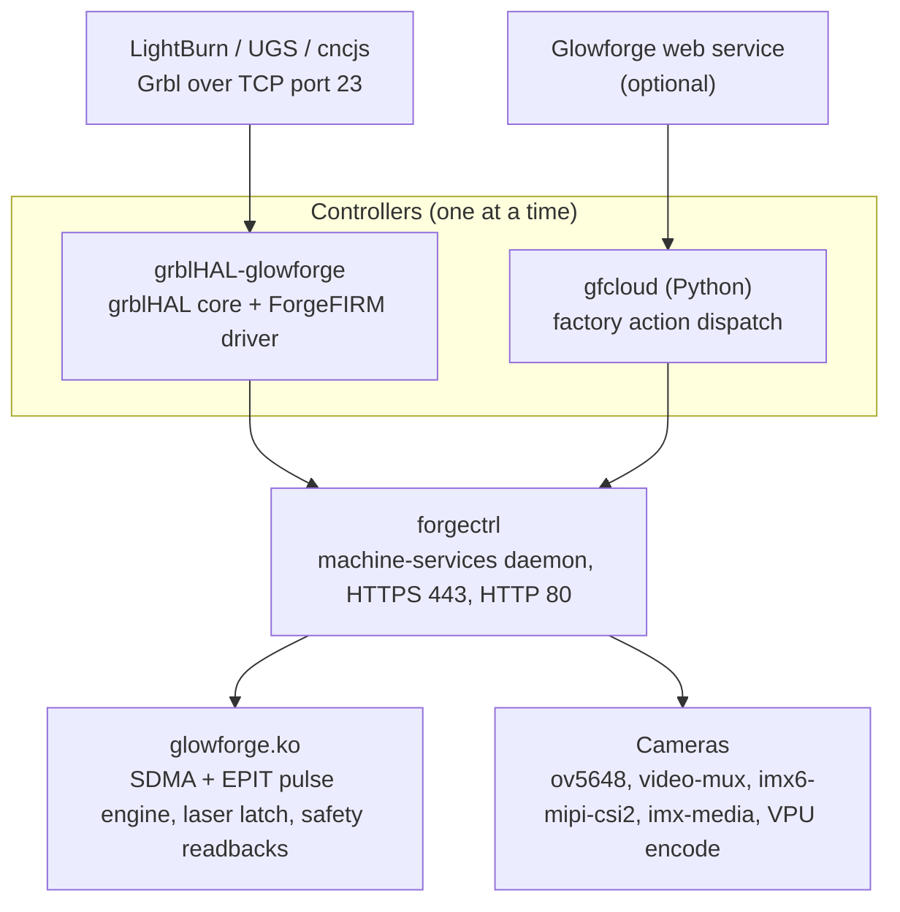

# How ForgeFIRM works

This section describes the ForgeFIRM software: what runs on the control
board, how the parts connect, and why they have the shape they have. This
page is the overview. The other pages of the section detail each part.

## What ForgeFIRM is

ForgeFIRM is open firmware for stock Glowforge lasers (Basic, Plus, and
Pro). It runs on the factory NXP i.MX6 control board already inside the
machine, with no hardware modification. It replaces the cloud-dependent
factory userspace with an open Linux image that controls the machine
locally. A stock Glowforge becomes a standard Grbl and LightBurn controlled
laser, with the factory cloud experience still available as an option.

It reuses what the factory hardware already does well, the low-jitter
SDMA + EPIT step-stream playback and the OV5648 MIPI cameras, and replaces
the cloud userspace with local software.

## What is replaced and what is kept

The factory machine cannot cut without Glowforge's servers. It downloads
serial-locked, gzip-compressed "pulse files" over a pinned-TLS session and
clocks that precomputed byte stream out of a DMA ring, through the i.MX6
EPIT timer and the SDMA engine, into a GPIO register: jitter-free hardware
step generation. ForgeFIRM keeps the SDMA + EPIT step-stream mechanism and
feeds it a live, planner-generated stream from grblHAL instead, which cuts
the cloud out entirely. The kernel module also accepts a whole precomputed
pulse file, which is how the optional cloud mode works.

The byte format and the playback engine are described under
[The step engine](../machine/step-engine.md). The factory software is
described under [The factory firmware](../machine/factory-firmware.md).

## Architecture

The layers, from the top:

- **The senders and the service.** In GRBL mode a Grbl sender (LightBurn,
  UGS, cncjs) connects over TCP port 23. In cloud mode the Glowforge web
  service drives the machine.
- **The controllers.** Exactly one runs at a time; the choice is the
  *mode*. `grblHAL-glowforge` is the grblHAL core plus the ForgeFIRM
  driver: the G-code parser, the planner with look-ahead, and the Grbl
  protocol; a **step backend** that resamples step events to pulse bytes and
  live-feeds the kernel ring; the **laser** path, which emits power bytes
  and the FIRE bit under an operator-armed window; and a **cooling client**
  that reports job state and enforces the cooling verdict
  ([The grblHAL driver](grblhal-driver.md)). `gfcloud` is a Python daemon:
  it dispatches the factory actions and preloads factory pulse files
  ([Cloud mode](cloud-mode.md)).
- **forgectrl**, the machine-services daemon on HTTPS port 443 and HTTP
  port 80: the
  supervisor that spawns and respawns the selected controller, the
  pulse-device broker (one exclusive hold of `/dev/glowforge`; the
  controllers inherit the file descriptor), the motion-liveness gate, the
  cooling engine (the sole owner of the thermal hardware), the cameras,
  telemetry, settings, diagnostics, the web control panel, and the A/B
  updates ([forgectrl](forgectrl.md)).
- **glowforge.ko**, the kernel module: SDMA + EPIT playback into the GPIO
  register that drives the stepper drivers, the laser latch, and the safety
  readbacks ([The kernel module](kernel-module.md)).
- **The cameras**: the mainline `ov5648` driver, `video-mux`,
  `imx6-mipi-csi2`, and `imx-media` (IPU CSI), with JPEG and H.264 encoding
  on the VPU ([The video pipeline](video-pipeline.md)).

A reserved memory pool in the device tree backs the pulse ring. The pool,
the ring size, and what the size means for each mode are described under
[The image and the BSP](image-and-bsp.md) and
[The step engine](../machine/step-engine.md).

## Laser safety

The hardware chain is the safety boundary, and it stays that way:
`LID_SW1 & LID_SW2 & INTERLOCK & HV_OK & supplies-OK -> OK_2_FIRE`, and
`FIRE & OK_2_FIRE -> LASER_ON`. `LASER_ON` is never a bare GPIO. The chain
is described under [The safing chain](../machine/safing-chain.md); the gates
as the operator meets them are in [Safety](../../safety/index.md) and
[GRBL mode](../../usage/grbl-mode.md).

On top of the chain, software adds gates in front of it, and never a bypass:

- the kernel **laser latch**, locked by default; the final close of the pulse
  device relocks it ([The kernel module](kernel-module.md));
- the **operator-armed window**: the physical button must be pressed before
  the first fire of a job, and the window relocks after idle
  ([The grblHAL driver](grblhal-driver.md#the-armed-window));
- the coolant **fire gates**: flow verification and over-temperature
  ([The cooling engine](cooling-engine.md));
- fail-safe behavior on fault, abort, or underrun
  ([The pulse-feeder contract](pulse-feeder-contract.md)).

Position counters are not proof of physical motion. The head accelerometer
is (see "Who owns the motion hardware" below).

## Design decisions

- **Device ownership.** forgectrl holds `/dev/glowforge` for its lifetime,
  and the controllers inherit the file descriptor. A handover never cycles
  the 40 V motor rail, because a rail glitch can leave the stepper drivers
  unserviceable. The rail stays up while the machine is on
  ([forgectrl](forgectrl.md)).
- **Kernel interface shape.** The kernel ring accepts live appends during a
  run, with `free` as the backpressure primitive, plus explicit end-of-data,
  underrun, and dead-man semantics
  ([The pulse-feeder contract](pulse-feeder-contract.md)).
- **Real time.** The kernel runs with `CONFIG_PREEMPT=y`, a deep ring, and a
  `SCHED_FIFO` feeder. PREEMPT_RT is not selectable on arm32 6.12, and the
  buffer arithmetic makes it unnecessary
  ([The grblHAL driver](grblhal-driver.md#real-time-design),
  [The image and the BSP](image-and-bsp.md)).
- **Cameras.** The mainline `ov5648`, `video-mux`, `imx6-mipi-csi2`, and
  `imx-media` drivers, not the factory NXP `ov5648_mipi.c`. forgectrl owns
  the pipeline. The 8 MP "HD" (OV8856) capture path is implemented and
  untested on hardware ([The video pipeline](video-pipeline.md),
  [The cameras](../machine/cameras.md)).
- **Cloud mode stays.** The factory cloud experience is kept and maintained
  as a mode, never stripped ([Cloud mode](cloud-mode.md),
  [Cloud mode, for the operator](../../usage/cloud-mode.md)).
- **A/B slot install.** ForgeFIRM installs into the unused factory A/B rootfs
  slot and archives every factory version first. `ffboot` switches slots,
  and `fwup` applies signed `.fw` releases
  ([Install and update](install-and-update.md),
  [Install](../../install/install.md),
  [Back to the factory firmware](../../install/factory-restore.md),
  [Updating](../../install/updating.md)).

## Who owns the motion hardware

`forgectrl`, the machine-services daemon, owns the pulse device for as long
as it runs and hands the open connection to whichever controller is active.
Only one controller, GRBL or cloud, runs at a time, and switching between
them is a live operation from the web panel.

Two behaviors follow from this that you will notice:

- **The 40 V motor rail stays up while the machine is on.** Handing the
  device from one controller to another never cycles it. The stepper drivers
  on this board can latch into an unserviceable state on a rail glitch (the
  position counters keep counting while the motors produce nothing), so the
  rail is left alone.
- **The machine proves it can move before the first job of a session.**
  Before the first controller start, forgectrl makes a short test move
  (always to the right first; a cable lives at the left end of travel) and
  confirms it with the accelerometer in the print head. If it sees no motion
  it powers the rail down and retries with progressively longer off periods.
  If the drivers still will not wake, it reports a **motion fault** instead
  of starting a controller, and the panel offers a retry. Position counters
  advancing are never accepted as proof that the machine moved.

## The two modes side by side

| | GRBL mode | Cloud mode |
|---|---|---|
| Who plans motion | grblHAL on the machine | the Glowforge service |
| Input | G-code over TCP port 23 | a downloaded pulse file |
| Ring use | live-streamed, small window | preloaded before the button; topped up as it drains when the job is longer than the ring |
| Machine tick | 28160 Hz default | 10 kHz (from the job header) |
| Job length limit | none | none (the ring buffers ~56 minutes at a time) |
| Needs internet | no | yes |
| Laser arming | button press per job | button press per job |
| Button mid-job | feed hold / cycle start | pause with backtrack / resume with lead |
| Lid or interlock open | cancel + return to job start | cancel + park at job start |
| Homing | `$H` (camera; limit switches planned) | automatic, camera-based |
| Fan control | `M8`/`M9` plus the armed window | per-job duties from the job header |
| Underrun possible | yes (handled as a fault) | no (nothing is streamed) |

Only one mode runs at a time. Switch from the panel's Status tab; the switch
is allowed only when the machine is idle ([Modes](../../usage/modes.md)).

## The pages of this section

| Page | Contents |
|---|---|
| [The kernel module](kernel-module.md) | `glowforge.ko`: the pulse engine, the laser latch, the safety readbacks, the sensors, and the sysfs tree. |
| [The pulse-feeder contract](pulse-feeder-contract.md) | The pulse device: the ring, append and free, end of data, underrun, the dead-man, and backtrack. |
| [The grblHAL driver](grblhal-driver.md) | The GRBL-mode controller: from G-code to pulse bytes, the laser path, the armed window, lid and button handling, faults, the cooling client. |
| [forgectrl](forgectrl.md) | The machine-services daemon: supervision, the pulse-device broker, the motion-liveness gate, telemetry, settings, diagnostics. |
| [The cooling engine](cooling-engine.md) | Fans, pump, TEC, and heater; flow verification; the gates; the job-state reports and the verdict file. |
| [The video pipeline](video-pipeline.md) | What the cameras send, the privacy gate, the encoders, lighting, and the arbitration of the single camera path. |
| [Cloud mode](cloud-mode.md) | The factory-experience client: components, scope, jobs, the firmware-update policy, the offline service, the emulator. |
| [Homing](homing.md) | Camera-referenced homing in both modes, running unhomed, and the planned limit-switch cycle. |
| [Install and update](install-and-update.md) | The A/B slot installer, the invariants and contracts of the update system, the release pipeline. |
| [Logging](logging.md) | One transport, one writer: the emitters, the loggers, the levels, the export sanitizer. |
| [The image and the BSP](image-and-bsp.md) | The Yocto layers, the kernel, the device tree, and the reserved memory pool. |
