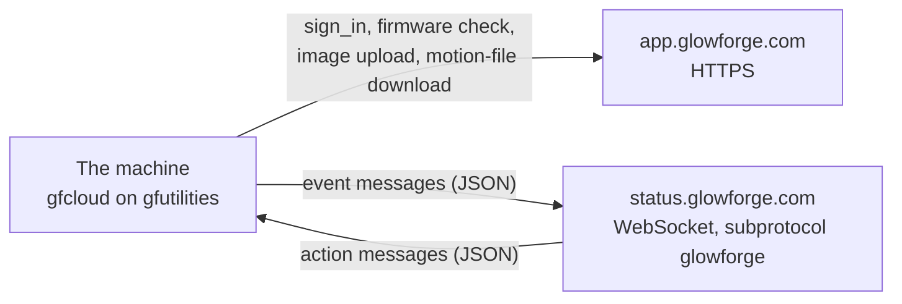

# Cloud protocol

This page describes the Glowforge cloud protocol as the machine speaks it: the
two channels, sign-in and the tokens, the wire format, the action vocabulary,
the events a machine emits, progress reporting, and image upload. The protocol
is undocumented by Glowforge and can change without notice. How ForgeFIRM's
cloud mode is configured, which per-action settings it honors, and what it
deliberately does not do are on [Cloud mode](../forgefirm/cloud-mode.md); how
the factory machine behaves inside a session is on
[Factory firmware](factory-firmware.md).

## Two channels

The machine uses two channels, mirroring the real device:

1. **HTTPS** (`https://app.glowforge.com`): sign-in, firmware check, image
   upload, and motion (pulse) file download.
2. **WebSocket** (`wss://status.glowforge.com`): a persistent,
   auto-reconnecting control channel (subprotocol `glowforge`) carrying JSON
   *action* messages from the service and *event* messages from the machine.

<div class="diagram" markdown>



</div>

The client components that drive the two channels (`WsClient`, `GFUIService`,
the machine object) are drawn on [Cloud mode](../forgefirm/cloud-mode.md).

`GFUIService` owns the receive and transmit queues and dispatches each incoming
action to the machine object; the machine performs the work (capture, upload,
download, and so on) and pushes status events back onto the transmit queue,
which the `WsClient` drains to the service. The library that implements this is
[Glowforge-Utilities](https://github.com/ScottW514/Glowforge-Utilities/blob/master/README.md).

## Connection and authentication

- The machine signs in at `/machines/sign_in` with its serial number and
  password. `sign_in` returns two JWTs: `auth_token` (Bearer, ~6 h) and
  `ws_token` (a path component of the WS URL, ~30 s expiry, single-use).
- The WS client reconnects through a loop that re-runs `sign_in` for a fresh
  `ws_token` and rebuilds the URL on every reconnect.
- The service drops the socket on its own schedule, roughly hourly in a long
  idle session. That is routine: the reconnect loop re-authenticates with a
  fresh `auth_token` and the machine stays signed in and serving actions
  without operator involvement.
- Any HTTP request that gets a 401 re-signs-in and replays once (the sign-in
  request itself never retries, so there is no recursion).
- `ws_connect()` returns the running client; `GFUIService` stops it (flush
  final events, close socket, join) when the session ends. The WS client and
  action threads are daemon threads: nothing about a session can keep the
  process alive after the service loop exits.
- TLS: standard certificate validation. The factory additionally pins the
  server SPKI and refuses unpinned connections; ForgeFIRM does not pin, by
  decision. A pin is a copy of a key the service can rotate whenever it likes,
  and chain validation already gives interoperability everything it needs.
- The service holds one session per machine.

## Wire format

A WS text frame may pack **several newline-delimited JSON objects**; each is
parsed separately, and unparseable objects are logged and skipped.

**Incoming action envelope** (server → machine): `id` (int64, becomes
`action_id`), `action_type`, `machine_serial` (ignored), `status`,
`motion_url` (hunt/motion/print), `settings` (sparse per-action dict), and on
image actions `endpoint` (presigned upload URL).

Only `status:"ready"` starts an action; the other statuses in the protocol
(`new`/`started`/`success`/`failure`) never launch work and are ignored.
**Cancellation is the same action `id` re-sent with `status:"cancelled"`.** <!-- style: ignore -->

**Outgoing event envelope** (machine → server): `id` (monotonic per-connection
counter), `timestamp` (ms since daemon start, not wall clock), `type:"event"`,
`version:1`, `level`, `action_id` (absent on unsolicited events), `event`.
Parser note: an event's `<action>` prefix segment can be empty; never assume
`split(':')[0]` is non-empty.

## Actions

The 2.6.0 vocabulary is twelve `action_type` values, and ForgeFIRM handles them
through a single dispatch table shared by `gfcloud` and `gfhome`:

| action_type | Behavior |
|---|---|
| `settings` | Sends the on-demand ~600-key settings report. Machine IP, firmware/app version, and serial reach the service through this report (`MCip`, `MCov`, `MCdv`, `MCsn`); there is no separate status endpoint. |
| `hunt` | Focus-lens homing (Z home + the service's hunt pattern + home offset). |
| `motion` | Downloads and runs the pulse file at `motion_url`. |
| `print` | Full print lifecycle (gfcloud only; gfhome refuses prints). |
| `lid_image` | Lid-camera capture + upload. |
| `head_image` | Head-camera capture + upload. |
| `lidar_image` | Head captures with the distance-measuring laser (per-shot settings arrive as a list). |
| `user_image` | User-requested snapshot: a lid-camera capture, lid closed. Same as `lid_image` in the factory too, name apart. |
| `factory_reset` | Refused with `factory_reset:failed` and **never acted on**: a cloud command must not wipe a ForgeFIRM machine. |
| `update_check` | Answered with `update_check:completed`; see the firmware policy on [Cloud mode](../forgefirm/cloud-mode.md). |
| `head_firmware_update` | Refused with `head_firmware_update:failed`: a cloud command does not flash the laser head. |
| `focus` | Ignored, as the factory application ignores it: its own dispatch has no case for the name. |
| unknown | Ignored. |

Only a `ready` status is a request to do anything. The four answered on the
protocol thread (`settings`, `update_check`, `factory_reset`,
`head_firmware_update`) act on `ready` alone: the service also sends a cancel
for actions a machine never received, and the factory ignores those rather than
answering them. The job actions are deliberately not gated that way, because a
cancel is how a print in flight is stopped.

Actions carry a sparse `settings` dict (for lidar, a list of dicts). Which keys
ForgeFIRM honors, and which it deliberately does not apply, is on
[Cloud mode](../forgefirm/cloud-mode.md). What the three unprompted actions do
in the factory is on [Factory firmware](factory-firmware.md).

## Events emitted

The service drives the entire lifecycle on this reduced event set (the large
factory event/progress state machine is advisory):

- Per action: `<action>:starting`, `<action>:completed`, `<action>:cancelled`. <!-- style: ignore -->
- Print lifecycle: `print:download:completed`, `print:running`,
  `print:paused` / `print:resumed`, `print:cancelled`, <!-- style: ignore -->
  `print:return_to_home:succeeded`, `print:completed`.
- Button: `button:pressed` / `button:released` (the app's "push the button"
  screen needs nothing else).
- Unsolicited `lid:opened` / `lid:closed`, which drive the app's header state
  and trigger an immediate service `lid_image` refresh.
- Alongside the events, a running print sends the `type:"progress"` frame
  described below. It is a different message type, not an event.

Service behavior worth knowing:

- After any mid-job abort the service re-hunts; after a completed print it
  issues a `lid_image` and a Z re-hunt.
- **The service dead-reckons machine position.** The return-to-home park runs
  after every print, finished or aborted, and ignores the lid and the cancel
  flag while it runs (the factory parks with the lid open, and a park cut short
  would offset every subsequent motion until the next camera re-home);
  `print:return_to_home:succeeded` is sent only when the park actually
  completed. A job refused before it moved (lid or interlock open at start, a
  backstop, since the app itself will not print until the lid is closed and
  imaged) ends `:cancelled`, never `:completed`. <!-- style: ignore -->
- Server-side session state can be sticky: after abnormal session deaths the
  service may stall silently mid-sequence in the next session. A fresh WS
  session recovers it.

## Progress reporting

The app's progress bar rides one carrier, as a capture of a factory session
shows:

- **The carrier is an outbound WSS `type:"progress"` frame**, machine to
  service, and nothing else. No `<action>:progress` event, and no
  `progress_bytes` query on the action endpoint, appears in a full session.
- **The progress frame is the periodic settings report.** Its `settings.values`
  block is exactly `periodic_settings_tags` (`BTvl CAid CCbp CCst CCxp CCyp
  CMet FTvl HTvl IRva IRvb IRvc IRvd ITvl LTvl`): board / fused / head /
  interconnect / lid temperatures, four IR values, a camera id, a coolant
  value, the byte position `CCbp`, the state `CCst`, and X/Y position
  `CCxp`/`CCyp`. Progress and the periodic telemetry are one message, which is
  why carrying it is cheap: the client already builds the ~600-key settings
  report on demand.

  ```json
  {"id":359,"type":"progress","version":1,"action_id":1577564802,
   "progress":"print:progress","current":994,"units":"steps","total":33291208,
   "settings":{"values":{"CCbp":1009,"CCst":1,"CCxp":0,"CCyp":0, ...}}}
  ```

- **Cadence is 30 s** (`progress_update_interval_ms` = 30000), plus a burst at
  every phase transition. During a cut `current` advances at the step
  frequency; at the phase boundaries the frame is `<action>:download`,
  `<action>:upload`, and so on, with `current` in bytes.
- **`total` is bytes enqueued, not the job.** In the captured print it grew
  33,291,208 → 33,553,352 → 33,815,496 in steps of 262,144 (256 KiB per
  interval): the factory live-appending to its ring, on the wire. A progress
  report of `current/total` therefore divides by a denominator that is itself
  growing.
- `CCbp` reads the byte position (1009 against `current` 994 in the frame
  above). It is telemetry, not a job parameter: the factory's own tag table
  marks `CCbp` and `CCbt` report-only, so neither can appear in a pulse
  header at all, and the pause constants are ForgeFIRM settings
  (see [Cloud mode](../forgefirm/cloud-mode.md)).

**What ForgeFIRM sends.** The same frame, at the same 30 s cadence, forced at
every phase change: the run's start, each pause and resume, each hold for a
stalled feed, and once more where the job ends. A print is the only action that
reports, which is what the factory does too, and its park reports under the
print as its last leg. `current` is the byte position the kernel has played, so
it steps back after a pause backtracks, exactly as the factory's does. A pause
is reported as the two events `print:paused` and `print:resumed`; the
factory's ten-event pause phase machine (`print:pausing_decel`,
`print:pausing_backtrack`, `print:paused`, `print:resuming`, each with
`:starting`/`:succeeded`) is advisory and is not mirrored, and neither are its
transfer-phase frames (`<action>:download`, `<action>:upload`), since the
`:starting` event already says the same thing.

Of the fifteen periodic tags the factory packs into the frame, ForgeFIRM fills
the five that describe the job (`CAid`, `CCbp`, `CCst`, `CCxp`, `CCyp`) and
leaves the temperatures and the IR readings out.

The denominator is the one place ForgeFIRM deliberately does better. The job's
length is known before a byte plays: a plain body carries it in its size and a
compressed one in the gzip ISIZE trailer, so the whole job never has to be
inflated to learn it. That figure is frozen when the run starts and every frame
divides by it, which is why the bar means what it says under a live feed where
the kernel's own byte total is still climbing. A job that plays past its
declared length reports complete rather than overshooting, and says so in the
log once. The length is named in the log at the start of every job, and a job
that does not end where it said it would is named there too.

## Image upload

Image actions carry a presigned `endpoint` URL; the image is `PUT` there as a
plain request (the presigned URL carries its own auth; a Bearer header makes
the storage backend reject it). Without `endpoint`, the legacy
`POST /api/machines/<action_type>/<id>` fallback is used.

## Firmware check

`firmware_check` is a version probe only: the machine reads
`GET /update/current` and never downloads factory firmware. ForgeFIRM's policy
around it is on [Cloud mode](../forgefirm/cloud-mode.md).
