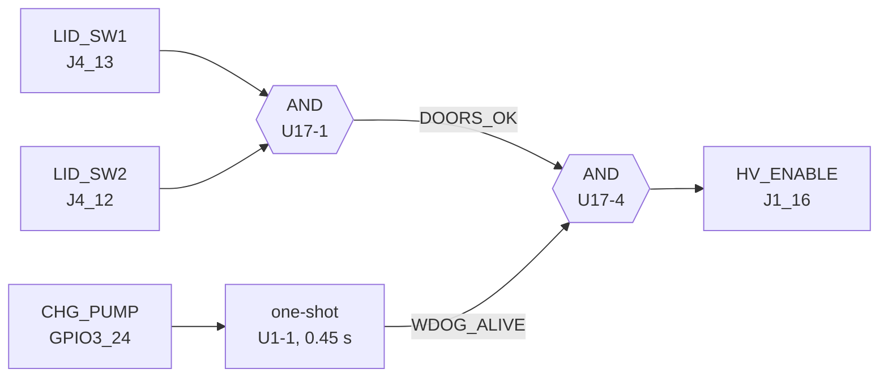
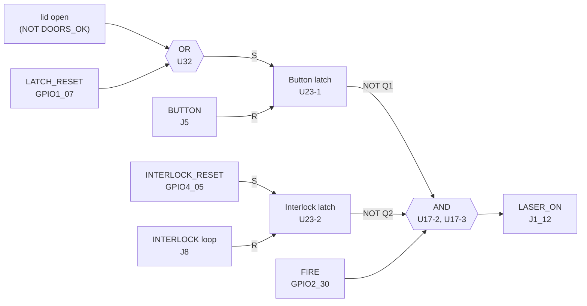

# The safing chain

This page describes the discrete laser-safing hardware on the factory control
board: the parts, the inputs, the outputs the SoC can drive, the logic, and what
each condition does in hardware alone. It also lists what is proven and what is
not established. The principle behind the chain is on
[Safety](../../safety/index.md); the software gates ForgeFIRM stacks on top of
it are on [GRBL mode](../../usage/grbl-mode.md) and the ForgeFIRM internals pages
linked below.

The hardware chain is the safety boundary. Software only ever adds gates in
front of it and never bypasses it.

Signal names follow the factory board's nets. `GPIOx_yy` is the i.MX6 GPIO; the
Linux name in parentheses is how ForgeFIRM exposes it (device-tree `gpio-keys`
switch, or `glowforge.ko` `/sys/glowforge/cnc` attribute; the attribute
reference is on [the kernel module](../forgefirm/kernel-module.md)).

## Parts on the control board

| Ref | Part | Role |
|---|---|---|
| U1 | SN74AHC123A dual retriggerable monostable, R ≈ 499 kΩ / C ≈ 1 µF (t_w = 454 ± 3 ms, measured pulse-to-drop) | Charge-pump watchdog: Q stays high only while CHG_PUMP keeps arriving; times out 0.45 s after the last pulse |
| U5, U6 | SN74AHC14 hex Schmitt-trigger inverters | Level inversion and conditioning for every switch line and SoC readback |
| U17 | SN74AHC08 quad 2-input AND | The four gates: DOORS, HV_ENABLE, and the two-stage LASER_ON gate |
| U23 | CD4043B quad R/S latch (NOR type, active-high S/R, output enable tied high) | Latch 1 = button latch, latch 2 = interlock latch |
| U32 | 74AHC1G32 single 2-input OR | Lid-open OR SoC lock → button latch SET |
| U24 | 74AHC1G04 single inverter | HV_ENABLE readback to the SoC (the pin carries ¬HV_ENABLE; the factory design labels this net **E-STOP**) |
| U18 | i.MX6 Solo | The SoC: drives CHG_PUMP, LATCH_RESET, INTERLOCK_RESET, FIRE; reads everything else |

## Inputs

| Net | Source | Conditioning | SoC pin | Linux exposure | Meaning |
|---|---|---|---|---|---|
| DOOR_SW1 (L) | J4_13, lid switch pulled to 3.3 V when closed | U5-1 inverts | GPIO4_14 (ball T6) | `gpio-keys` code 0 `door1`, active low → **active = closed** | Left lid switch |
| DOOR_SW2 (R) | J4_12 | U5-2 inverts | GPIO1_06 (T3) | code 1 `door2`, active low → **active = closed** | Right lid switch |
| DOORS | U17-1 = DOOR_SW1 · DOOR_SW2 | U5-3 inverts | GPIO1_00 (T5) | code 3 `doors`, active low → **active = both closed** | The lid term the chain actually uses |
| BUTTON | J5_5, 12 V through the button, 27 kΩ / 8.7 kΩ divider (≈ 2.9 V when pressed) | U5-5 inverts | GPIO4_09 (U6) | code 2 `button`, active low → **active = pressed** | Big front button. Also the RESET input of the button latch |
| INTERLOCK_SW | J8, 12 V through the remote-interlock loop, 432 Ω / 165 Ω divider (≈ 3.3 V when the loop is closed); factory-jumpered on Basic/Plus, brought out on Pro | U6-2 inverts | GPIO1_09 (T2) | code 5 `interlock`, active high → **active = loop OPEN** | Also the RESET input of the interlock latch |
| CHG_PUMP watchdog Q | U1-1 Q (pin 13): /A = GND, /CLR = 3.3 V, B = CHG_PUMP; each rising edge retriggers | U6-6 inverts | GPIO1_08 (R5) | `cnc/charge_pump_alive` (logical), `interlock_circuit` bit 5 (raw, 0 = alive) | Watchdog alive |
| Button latch state | U23-1 Q → U5-6 → U6-1 | double inversion | GPIO1_03 (R7) | `cnc/button_latch`, `interlock_circuit` bit 2 | 1 = latch SET (fire blocked, not armed), 0 = armed |
| Interlock latch state | U23-2 Q → U6-3 → U6-4 | double inversion | GPIO1_02 (T1) | code 6 `interlock_latch`, active high → **active = latch SET** | 1 = interlock latch blocking |
| LASER_ON readback | J1_12 net (U17-3 output) | U6-5 inverts | GPIO1_05 (R4) | `cnc/laser_on`, `laser_on_sampled`, `interlock_circuit` bit 0 (raw, active low) | The gated output: the only software-visible proof of emission permission |
| HV_ENABLE readback (factory net name E-STOP) | U24 = ¬HV_ENABLE | none | GPIO4_06 (W5) | code 4 `hv_enable`, active low → **active = HV_ENABLE asserted** | Readback of the chain's own output, **not** an input: inactive at idle, active only while a run feeds the watchdog with the lid closed |
| LASER_PGOOD | J1_14 (the supply's power-good line, `HV_PFC_STOP` on the test-point sheet, TP_A2C) | none | GPIO4_21 (P24) | `cnc/laser_pgood`, `laser_pgood_sampled` (active high) | The supply's supervisor (a WT7525, whose open-drain PGO reports every DC output within spec and drops on an over/under-voltage or over-current fault) drives it high the whole time the supply is healthy. Measured: high at idle, through HV_ENABLE cycles and through a full-power cut, and held high against a 100 kΩ pull-down, so it is driven, not floating. A supply-fault witness, not an emission witness |

## SoC outputs into the chain

| Net | SoC pin | Driven by | Effect |
|---|---|---|---|
| CHG_PUMP | GPIO3_24 (F22, `charge-pump-gpio`) | `glowforge.ko`: one 0→1→0 pulse at run start, then every 200 ms from a soft hrtimer **only while `state == running`**; forced low on stop, disable, unload and kernel panic | Retriggers U1-1 (t_w = 454 ms, so a 200 ms feed holds Q solidly high and one missed pulse is tolerated). No edges → Q falls 0.45 s after the last pulse → HV_ENABLE drops with it |
| LATCH_RESET | GPIO1_07 (R3, `latch-reset-gpio`, init HIGH) | `cnc/laser_latch` (1 = lock). Also drives the FIRE line to high impedance while locked | Into U32 with lid-open; SETs the button latch → LASER_ON blocked until the next button press |
| INTERLOCK_RESET | GPIO4_05 (P5, `interlock-latch-reset-gpio`, init HIGH) | `glowforge.ko`: high whenever the remote-interlock loop reads open, or until a switch device reporting the loop has attached; low only while an attached device reports it closed (in-kernel input handler on the gpio-keys switch, EV_SW code 5). Read back as `interlock_latch_reset` / `interlock_circuit` bit 4 | SET input of the interlock latch → LASER_ON blocked in hardware while the loop is open |
| FIRE (LASER_ENABLE) | GPIO2_30 (E22, `laser-enable-gpio`) | The SDMA script, from bit 4 of each pulse byte; Hi-Z whenever the latch is locked or no run is in flight | One input of the final LASER_ON AND gate |

Laser *power* (PWM2 on J1_13) is not part of the chain: it sets the tube
current setpoint and is not gated. Emission permission is FIRE ∧ chain; the
laser-off guarantee rests on FIRE, and the kernel drops FIRE within one tick on
end-of-data or underrun. See [The laser](laser.md).

## Logic

```
DOORS_OK      = DOOR_SW1 · DOOR_SW2                              (U17-1)
WDOG_ALIVE    = U1-1 Q, retriggered by every CHG_PUMP rising edge
HV_ENABLE     = DOORS_OK · WDOG_ALIVE                            (U17-4)  → J1_16
                ¬HV_ENABLE                                        (U24 inverter) → GPIO4_06, read back as `hv_enable`

Button latch (U23-1):
  SET   = ¬DOORS_OK + LATCH_RESET                                 (U32 OR)
  RESET = BUTTON pressed
  Q1    = 1 → fire blocked; 0 → armed

Interlock latch (U23-2):
  SET   = INTERLOCK_RESET (SoC: high while the loop reads open or is unobservable)
  RESET = interlock loop closed
  Q2    = 1 → fire blocked

LASER_ON      = FIRE · ¬Q1 · ¬Q2                                 (U17-2, U17-3) → J1_12
```

The CD4043B is set-dominant: while SET is high the latch cannot be cleared.
That ordering is what makes the button meaningful. A press only arms the
machine when the lid is closed *and* the SoC has already released its lock.

The chain as wired, in two halves. Hexagons are logic functions on the
control board (the part reference below each). Wires carry logic levels;
1 = true as named. Physical switches are on the left, the lines the SoC
drives carry a GPIO name, and the outputs on the right go to the laser power
supply on J1. Software can only withhold FIRE, hold LATCH_RESET, drive
INTERLOCK_RESET, or stop feeding CHG_PUMP, and every one of those makes the
hardware block emission.

**HV_ENABLE: the lid and the watchdog.** The one-shot is retriggered by every
CHG_PUMP rising edge (200 ms pulses, only while a program runs).

<div class="diagram" markdown>



</div>

**LASER_ON: the two latches and FIRE.** Both latches are CD4043B, set-dominant:
while S is high, R cannot clear them. LATCH_RESET is `cnc/laser_latch`
(1 = lock; FIRE is also Hi-Z then). INTERLOCK_RESET is high while the loop
reads open or is unobservable. FIRE is pulse-byte bit 4, Hi-Z when locked or
idle.

<div class="diagram" style="--diagram-min: 68rem" markdown>



</div>

The SoC also reads the chain: `doors` (EV_SW 3, GPIO1_00) and `door1` /
`door2` (EV_SW 0 / 1, GPIO4_14 / GPIO1_06), `charge_pump_alive` (GPIO1_08,
the one-shot's inverted output), `hv_enable` (EV_SW 4, GPIO4_06),
`button_latch` (GPIO1_03, = Q1), `interlock_latch` (EV_SW 6, GPIO1_02, = Q2),
`laser_on` (GPIO1_05), and `laser_pgood` (GPIO4_21, the supply's power-good
line on J1_14). These are readbacks for monitoring only; none of them adds an
emission path.

## What each condition does, in hardware alone

| Event | HV_ENABLE | LASER_ON | Recovery |
|---|---|---|---|
| Lid opens (either switch) | drops (DOORS_OK low) | drops immediately: ¬DOORS_OK SETs the button latch | close the lid, SoC lock released, **press the button** |
| SoC asserts LATCH_RESET (kernel `laser_latch=1`) | unchanged | blocked: button latch SET; FIRE line is also Hi-Z | `laser_latch=0`, then a button press |
| SoC stops toggling CHG_PUMP (hang, panic, stop, fault, underrun) | drops within one one-shot period | FIRE is parked by the same paths | next run restarts the feed |
| Button pressed with lid closed and lock released | no change | armed (Q1 cleared) | none needed |
| Button pressed while lid open or lock held | no change | stays blocked (SET is dominant) | none |
| Remote-interlock loop opens (Pro) | unchanged | blocked: the kernel drives INTERLOCK_RESET high on the switch edge, setting the interlock latch. Opening the loop by itself only releases the latch's RESET (the board has no direct trip path), so this SoC drive is what makes the interlock a hardware cut (see [the kernel module](../forgefirm/kernel-module.md)); software additionally cancels (or, with `lid_policy = hold`, parks) the job on `interlock` (see [GRBL mode](../../usage/grbl-mode.md)) | close the loop: the kernel releases INTERLOCK_RESET and the closed loop resets the latch |
| Interlock latch already SET | unchanged | blocked | closing the loop clears it |

`hv_enable` (GPIO4_06) is a readback of this chain's own output, not an input:
it is inactive on an idle machine and active for the duration of any kernel
run, the window in which the charge pump is fed and HV_ENABLE is alive. Nothing
in ForgeFIRM gates on it; it is telemetry. (The factory design labels the net
E-STOP; no Glowforge model has an e-stop input, and a retrofitted one belongs
in the lid-switch chain, where the hardware enforces it.)

## Software layers on top

Every software layer sits *in front of* the chain: it can only withhold FIRE,
hold the lock, or starve the charge pump. None can produce emission the
hardware would not allow.

- **`glowforge.ko`** owns the laser latch (locked by default; every close of
  `/dev/glowforge` relocks), feeds the charge pump only while a program runs,
  drops FIRE at end-of-data and underrun, drives the interlock latch, arms a
  dead man's switch on the pulse device, and safes the pins on a kernel
  panic. See [The kernel module](../forgefirm/kernel-module.md).
- **The grblHAL controller** adds the operator-armed window, the disarm
  grace, the coolant fire gates, the safety-door handling, and the button
  semantics. See [The grblHAL driver](../forgefirm/grblhal-driver.md) and
  [GRBL mode](../../usage/grbl-mode.md).
- **forgectrl** holds the pulse device, relocks the latch on every transition
  out of a running controller, publishes the cooling verdict, and refuses to
  start a controller on a machine whose motion is not proven. See
  [forgectrl](../forgefirm/forgectrl.md).
- **Cloud mode** runs behind the same kernel latch, charge-pump, backstop and
  dead-man rules. See [Cloud mode](../forgefirm/cloud-mode.md).

## What is proven, and how

The proof comes from bench drills with a probe on the PSU-connector LASER_ON
pin and the kernel readbacks. The
[campaign log](https://github.com/ScottW514/forgefirm/blob/master/docs/CAMPAIGN-LOG.md)
holds the drill records.

- Latch **locked**: 40,000 streamed FIRE bits → PSU pin flat, `laser_enable`
  0. The lock severs the FIRE drive entirely.
- Latch **unlocked, chain unarmed** (no button press): `laser_enable` 1
  mid-window, PSU pin flat, `laser_on` 0. The AND gate holds.
- FIRE drop at end-of-data and at true underrun: ≤ 1 tick, both termination
  paths.
- A latch unlock inside an acceleration ramp does not restore the FIRE drive
  for the in-flight run; a locked latch survives a stop + resume replay.
- Armed kill mid-FIRE: emission tail equals the ring in-flight only
  (15 to 171 ms), the latch relocks, the burn line ends abruptly.
- Switch bits 0 to 3, 5, 6 verified against physical state; bit 4
  (`hv_enable`) characterized live: inactive at idle, active through any run,
  and it flips together with `charge_pump_alive` on both edges (HV_ENABLE =
  DOORS_OK · WDOG_ALIVE observed).
- Interlock latch drive: with the connector unjumpered, `interlock`,
  `interlock_latch_reset` and `interlock_latch` all assert within one 50 ms
  sample and all clear when the loop is closed again.
- Watchdog period, measured directly from the SoC pins
  ([`cp_watchdog_timing.py`](https://github.com/ScottW514/forgefirm/blob/master/scripts/bench/cp_watchdog_timing.py):
  every CHG_PUMP pulse latched by the GPIO edge detector, the ¬Q and
  ¬HV_ENABLE pads polled at ≈ 0.2 ms): Q falls **451.8 / 455.6 ms** after the
  last pulse (t_w = 454 ± 3 ms, matching R·C); Q rises on the priming pulse
  and HV_ENABLE falls with Q within one sample; the kernel feed period is
  199.98 ms (199.87 to 200.07). A feed late by more than ≈ 254 ms therefore
  drops HV_ENABLE.

## Not established

Nothing on the readback or sense side. Every input in the table above has a
measured meaning, including the supply's power-good line on J1_14.
